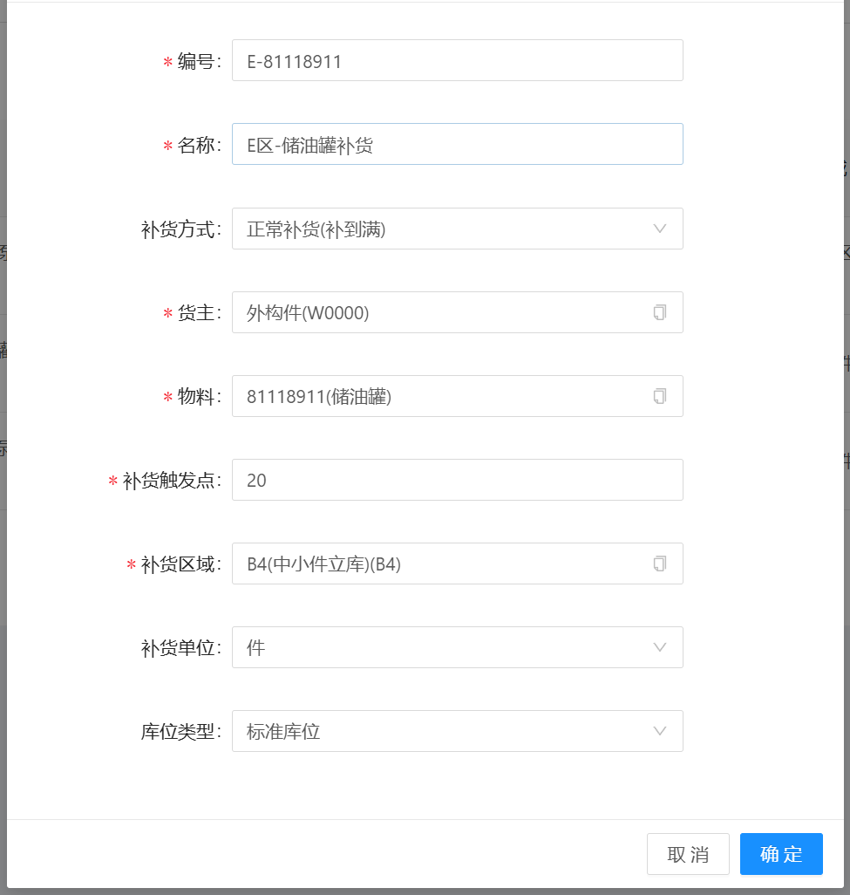
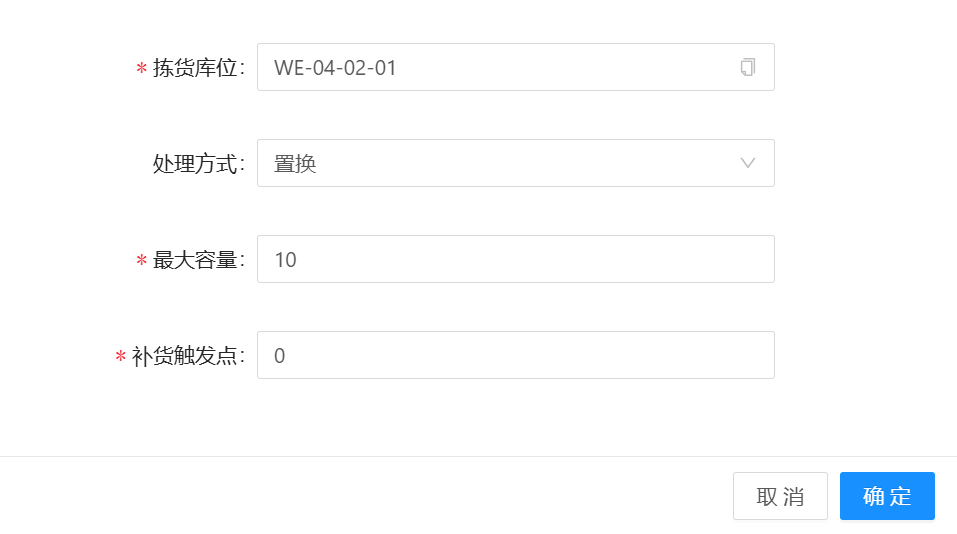
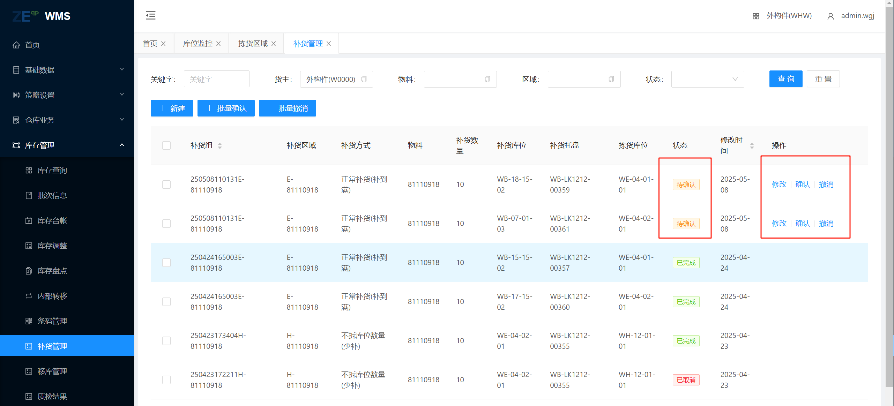
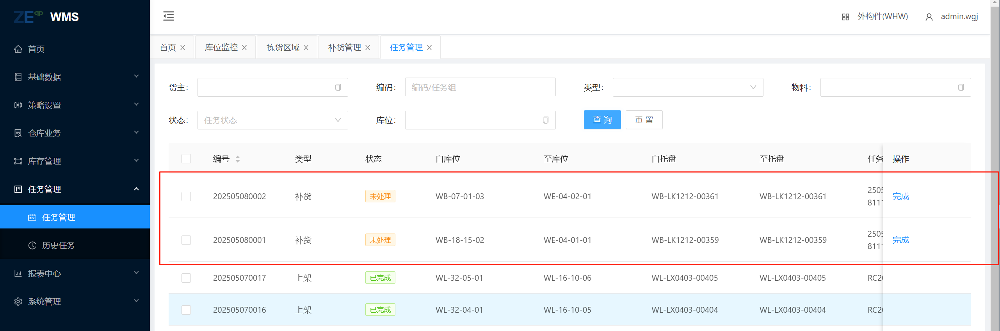

# E区物料补货

包含 拣货区域、补货管理，任务下发；创建拣货区域信息，由系统定时判断拣货区域信息，进行补货任务下发，输送，完成。

## 拣货区域

包含 新增、修改、拣货库位、补货 功能，主要进行需要补货的前置条件的设置，之后由系统定时检测执行；也可以手动执行，当信息输入完成后，点击“补货”按钮触发补货，在补货管理中生成补货信息。

### 拣货区域信息描述

物料：需要进行补货的物料

补货触发点：当小于这个数值时，进行补货

补货区域：从哪个区域获取物料

补货单位：补货的单位

库位类型：从区域的哪个库位类型获取物料

### 拣货库位信息描述

拣货库位：E区需要补货的库位

处理方式：E区域基本为置换方式

&nbsp;&nbsp;&nbsp;&nbsp;1.倒箱；托盘需要变更，将货物换到新托盘   

&nbsp;&nbsp;&nbsp;&nbsp;2.置换：不换托盘，直接将托盘放到此位置。

最大容量：托盘的最大存储量

补货触发点：一般为0，当小于等于此数值开始补货

## 补货管理

包含 确认、撤销 功能，当无误时，点击确认按钮生成任务，等待输送完成后任务自动完成

## 下发任务

在补货管理中任务下发后，将会在任务信息中查看到相应的补货任务，等待输送完成后任务自动完成，也可以在RF端进行手动完成

