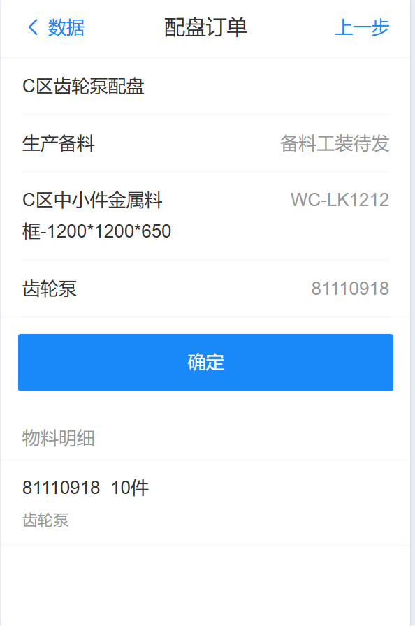
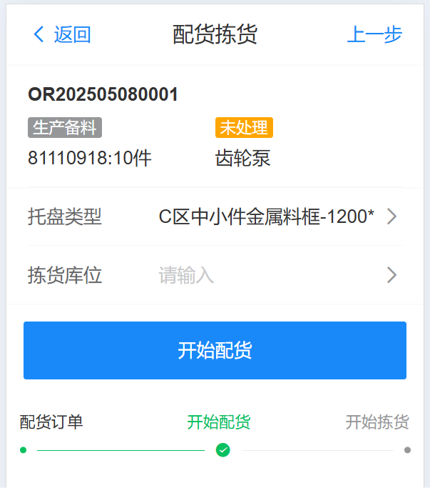
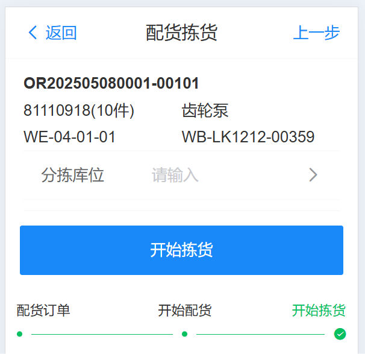
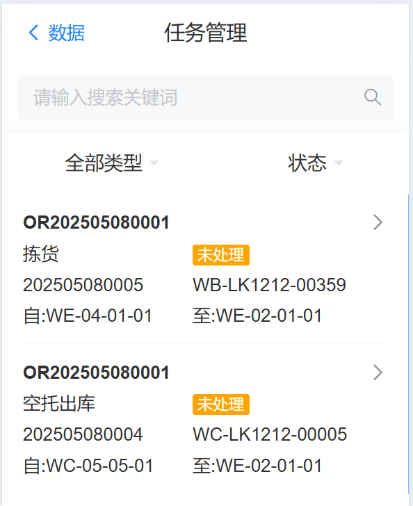
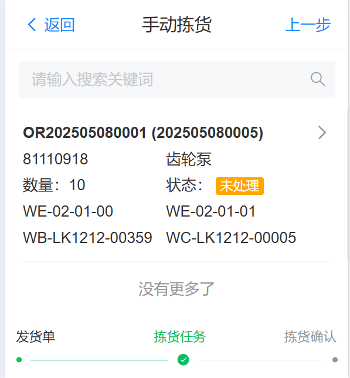
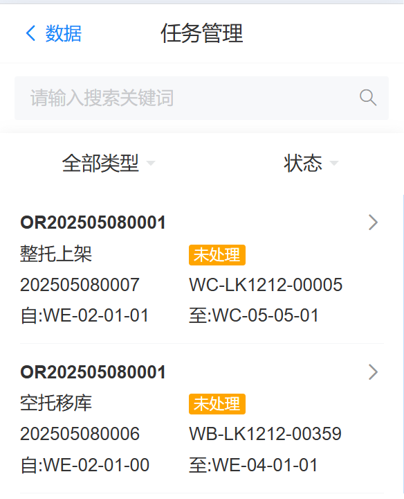

# E区物料备货待发区

包含发货策略、配盘策略、配盘管理、手动拣货等流程处理，需要从库区补货到E区，在进行人工处理备货到待发区

前置条件：

&nbsp;&nbsp;&nbsp;&nbsp;[1.维护发货策略](../../feture/stg/allocate#aheader) 

&nbsp;&nbsp;&nbsp;&nbsp;[2.维护配盘策略](../../feture/stg/plate#aheader) 

## RF配盘管理

当没有进行MOM对接时，进行手动配盘，检查信息无误后，点击确认进行配盘

{width=300px}

## RF配货拣货

拣货库位：物料最终放置的位置

分拣库位：来料的位置（中间点）

点击开始配货

   

&nbsp;

&nbsp;

配货后：将会生成一个从C区来的空托盘，一个拣货的任务信息

{width=300px}

## RF手动拣货

C区来的空托盘完成后，将货物倒换托盘，然后进行人工拣货确认

{width=300px}

拣货完成后，系统生成 整托上架C区的任务 和一个空托回E区的任务，由输送系统搬运完成后自动完成

{width=300px}