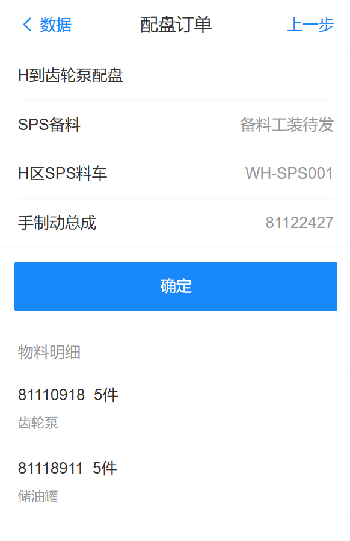
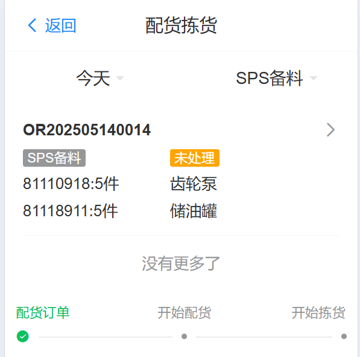
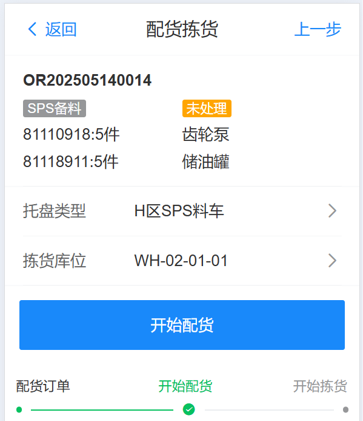
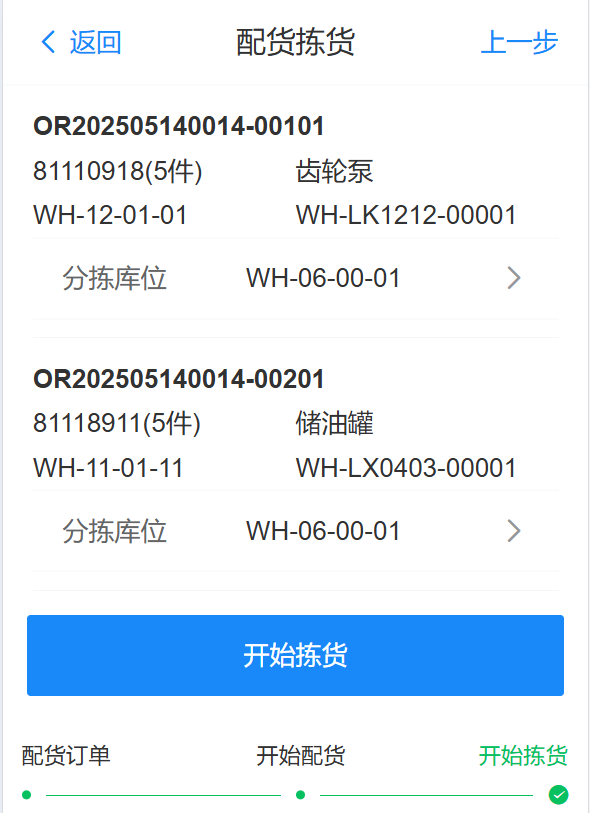
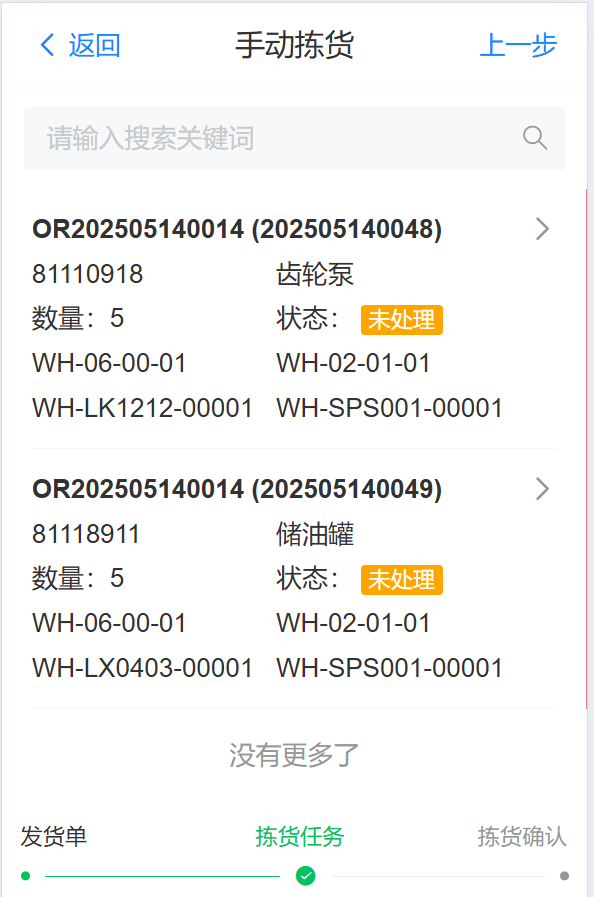
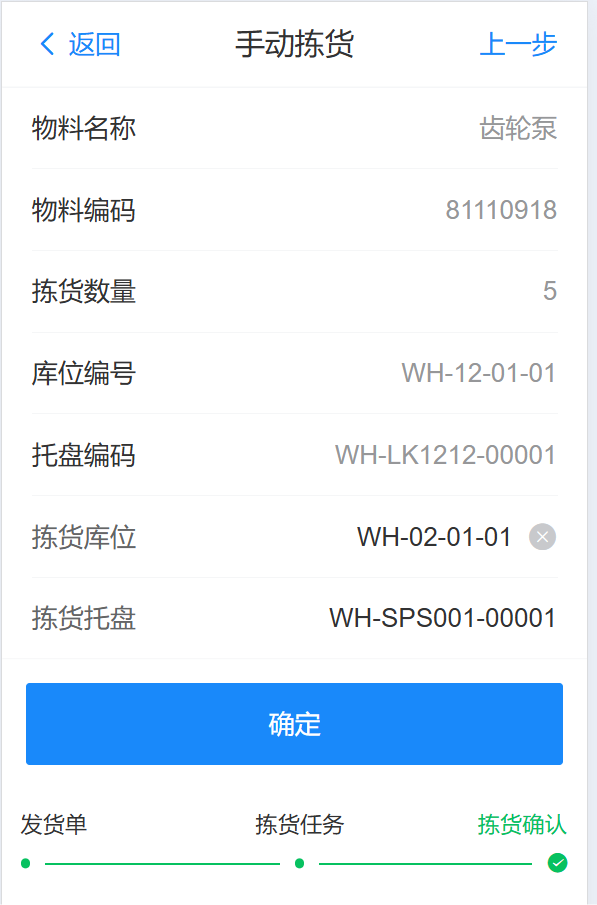

# H区SPS拣选至待发区

1.直接通过MOM系统拉取配货

2.由WMS系统自己进行货物配盘

&nbsp;&nbsp;&nbsp;&nbsp;[1.维护发货策略](../../feture/stg/allocate#aheader) 

&nbsp;&nbsp;&nbsp;&nbsp;[2.维护配盘策略](../../feture/stg/plate#aheader) 

### RF配盘管理

找到需要配盘的物料信息

{width=300px}

在明细检查配盘信息，确认无误后点击确认按钮

{width=300px}

### RF配货拣货

如下所示例，查询SPS备料的信息，然后点击查看明细，扫描/输入“拣货库位”，然后扫描/输入“分拣库位”（WH-06-00-01、WH-07-00-01、WH-08-00-01），点击开始拣货，等待agv搬运

  
   
   

### RF手动拣货

如下所示例，在手动拣货中，选择拣货明细，进行手动拣货确认

  
   

当最后一种物料拣货完成后，系统自动生成sps拣选完成的搬运任务，和托盘回库任务，等待agv搬运完成即可