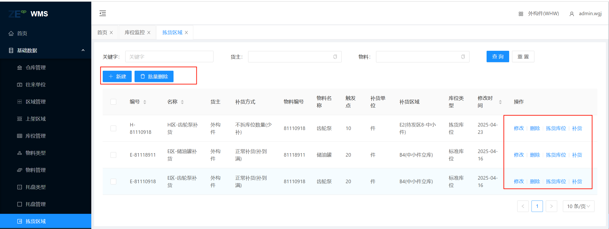
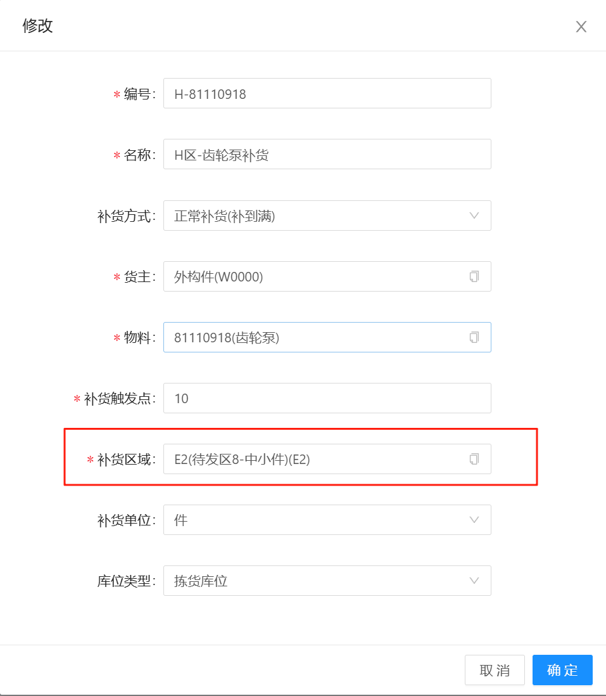
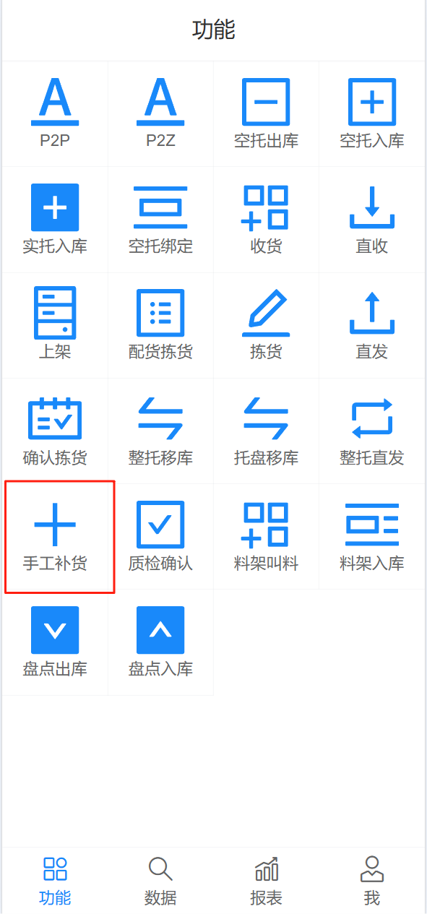
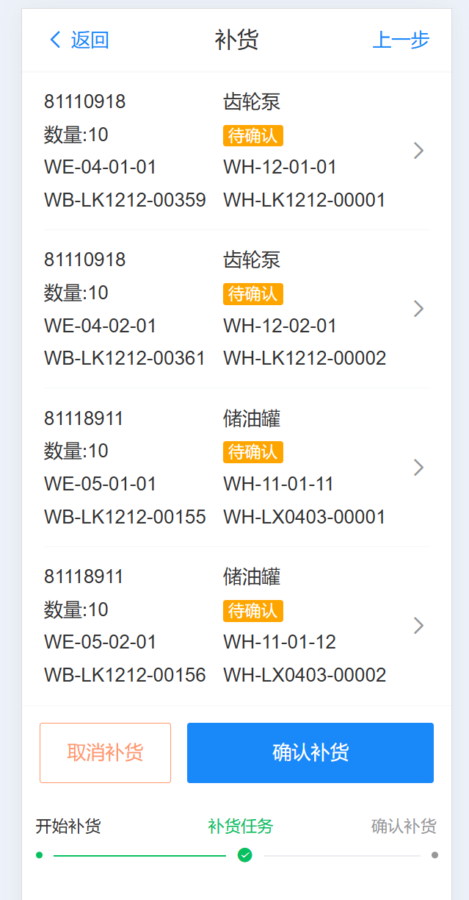

# H区补货

包含 拣货区域、RF手动补货；创建拣货区域信息，由人工在RF端系统上手工补货，进行补货任务下发，输送，完成。

## 拣货区域

包含 新增、修改、拣货库位、补货 功能，主要进行需要补货的前置条件的设置，之后由系统定时检测执行；也可以手动执行，当信息输入完成后，点击“补货”按钮触发补货，在补货管理中生成补货信息。

### 拣货区域信息描述

物料：需要进行补货的物料

补货触发点：当小于这个数值时，进行补货

补货区域：从哪个区域获取物料（H区域补货默认全部选择E2）

补货单位：补货的单位

库位类型：从区域的哪个库位类型获取物料（H区域补货默认全部选择  “拣货库位”）

## RF端手工补货

RF端手共补货，只针对于H区域人工补货，补货区域（H区补货 为 从 E2中小件区域 补货）

   

点击补货按钮执行整个区域补货，然后点击确认补货，生成补货任务，由AGV输送至指定的位置进行倒箱，挖成补货

