# 此目录写K区域操作说明文档

## 油缸收货和油缸质检  ##
根据现场业务分布，如图所示:  
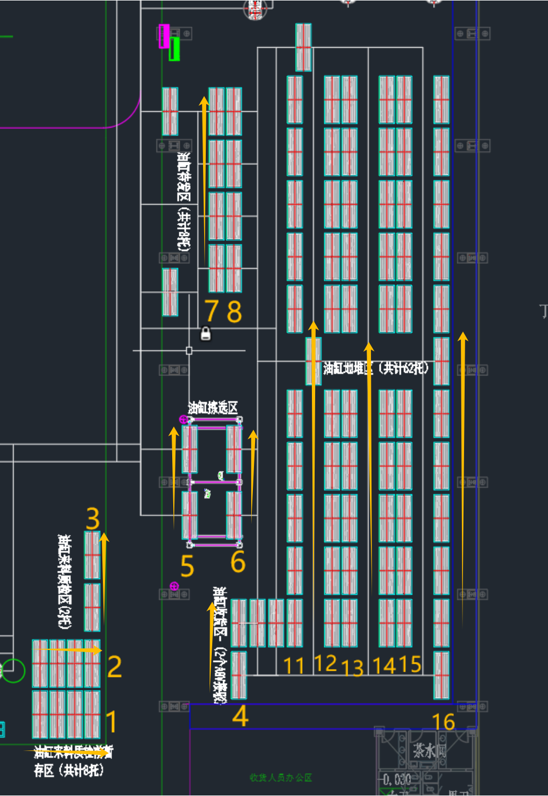  

从**油缸收货区**进行收货，根据收货规则需配置前置条件上架区域和批次策略，如下图：  

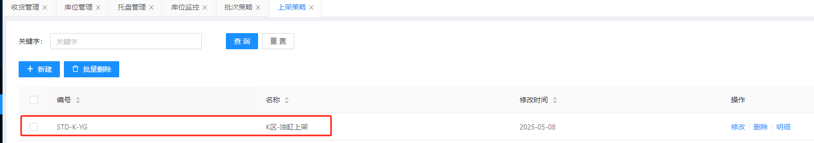  

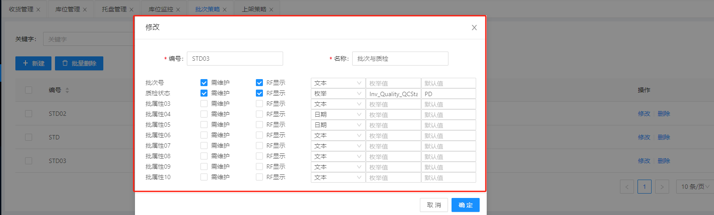  

**注:如果批次策略和质检都已经配置完毕，直接引用该策略即可，不需要重新配置。**

>创建收货单 

WMS外购件管理员通过菜单按钮仓库业务-收货管理，发起收货任务，如下图:
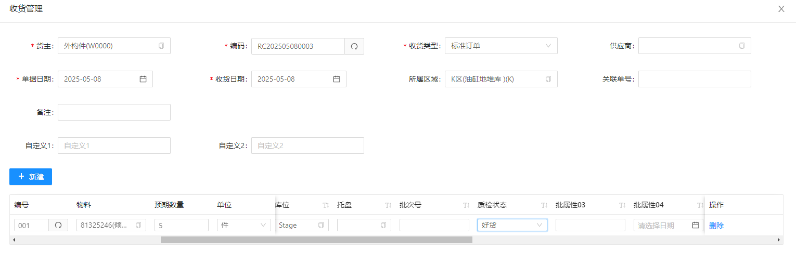  

创建完毕后，出现收货任务记录，如下图:  
    

>RF端收货

现场K库收货管理员根据收货单号，为收货区域WK-04-01-01 准备空托进行收货前准备,如下图:

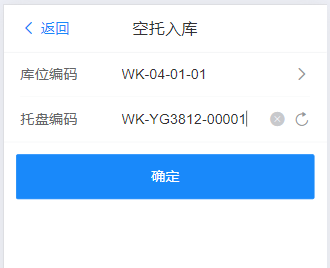   

线下业务员为WK-04-01-01库位通过RF端扫码进行空托库位绑定。点击确认完成操作,RF端会产生一条空托入库任务记录  
在RF段-数据-任务管理可以看到该任务记录，如下图:

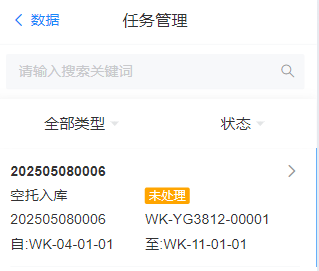  

**注：如果提示没有空库位可入，原因在于托盘上架区域没有进行匹配，需要到WMS系统中为该托盘配置上架区域和托盘绑定库位，如下图**

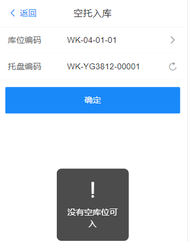    

需要进行以下步骤：

WMS系统-基础数据-上级区域-点击托盘类型（区域），如下图:  

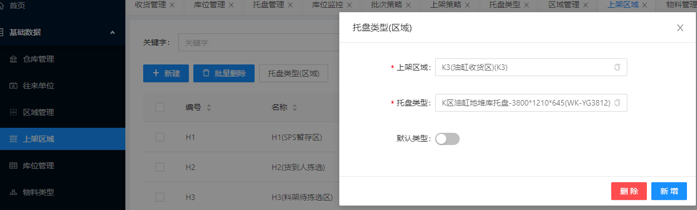  

WMS系统-策略设置-上架策略-找到所在区域上级策略（区域）,如下图:  

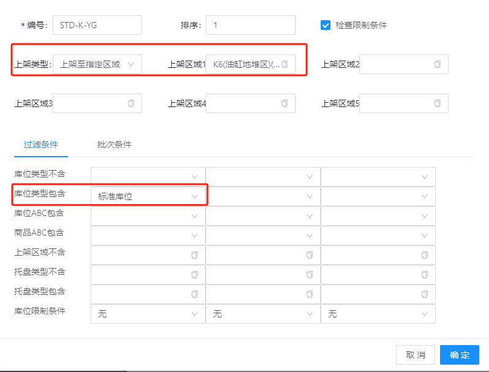
 

RF端业务员通过点击-功能-收货-通过RF扫码条形码扫码获取物料条形码-库位上绑定所属标签纸的库位编码-托盘上绑定的标签纸所属的托盘编码，如下
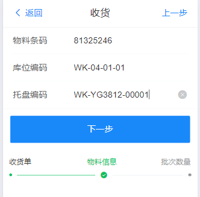  

点击下一步,输入收货详细信息,如下图:

 

输入实际收货数量 -批次号

在质检状态中，如果根据现场延时的货物选择货物的质量，注：**需根据WMS收货管理中的收货单中的质检结构一致**，如下图：

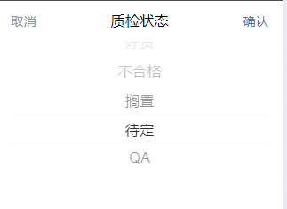 

点击确认，收货完成。 

## 油缸上架 ##

>RF端上架

K区收货人员完成收货以后，需将货物进行上架，操作员可以通过RF端-功能-上架进行上架处理，如下图：  

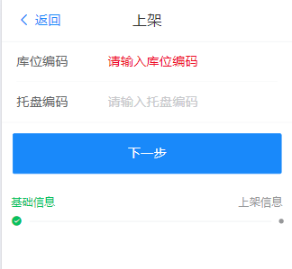   

通过RF端进行扫码进行编码输入-依次扫秒收货所在的库位编码-承载货物的托盘编码-下一步，

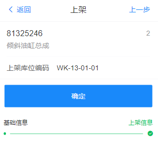  

点击确认，完成上架。

系统将自动产生上架任务信息，同时在WMS系统-仓库业务-收货管理能够跟踪该收货状态,如下图： 

RF端：

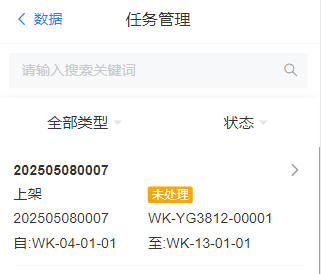  

WMS-收货管理状态监控:

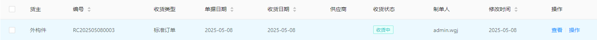  

操作员在RF段-数据-任务管理，找到对应上架任务-点击完成，即可完成上架任务，如下图:

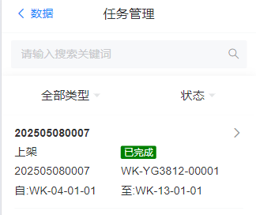  

同时WMS-仓库业务-收货管理中，状态发生变化

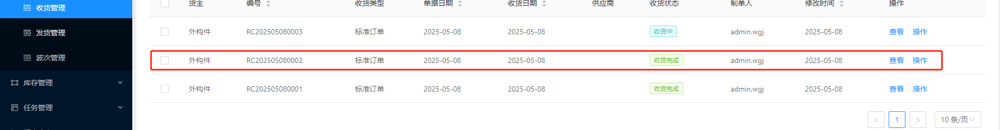   ，

最后将收货的空托任务完成空托入库操作，如下图:

数据-任务管理-空托入库类型-选择需要入库的托盘进行入库-点击完成

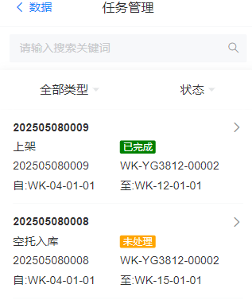   ，

## 油缸备货至待发区 ##

K区WMS管理员-进入WMS-策略设置-配盘策略-新建配盘策略，如下图：

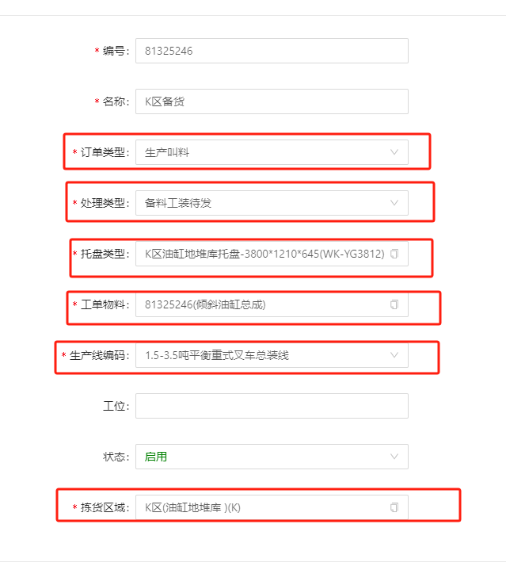  

创建完成以后，如下图，通过明细，物料，配置备货所需的物料、最小数量、最大数量、编号、单位，如下图：  

  

创建完成以后，如下图，通过库位设置备货的所在库位，如下图:

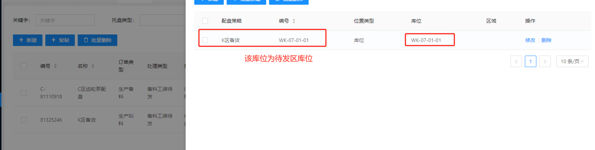 

进入基础数据-物料管理-查询对应区域的物料托盘类型，设置物料托盘随着的待发区,如下图：

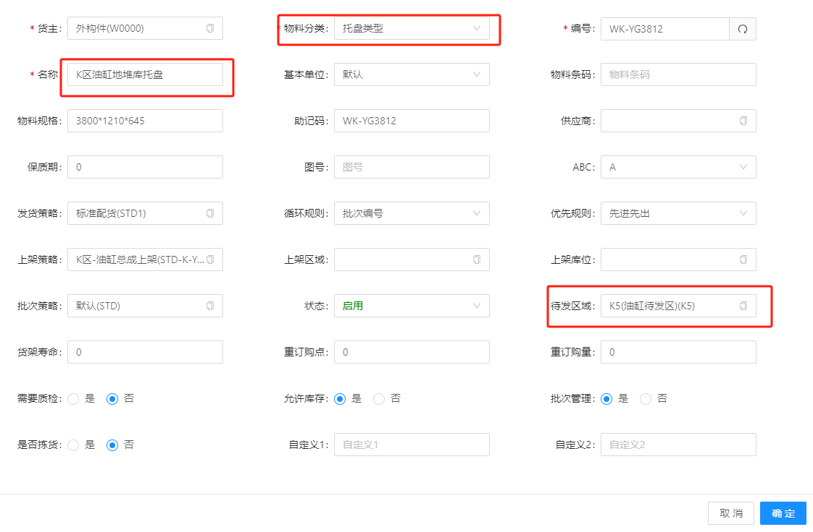 

>开始备货

K区业务管理通过RF端-数据-配盘管理进入到配盘列表，如下图:   

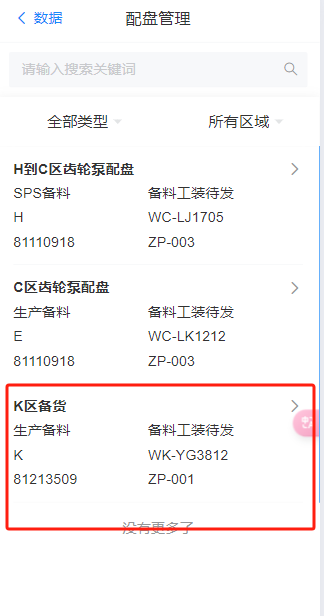 

点击该项-进入详情页-点击确认开始备料,如下图:  

  
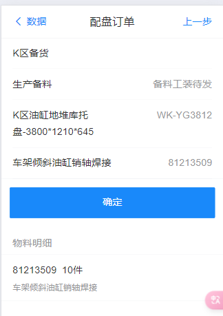 

确认完成后，系统触发配货拣货任务，K区业务管理通过RF端-功能-配货拣货，进入到配货拣货详情列表，如下图:  

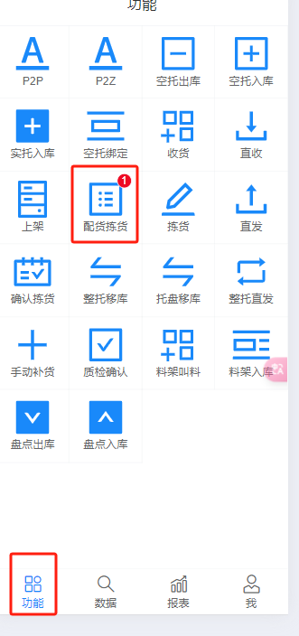   
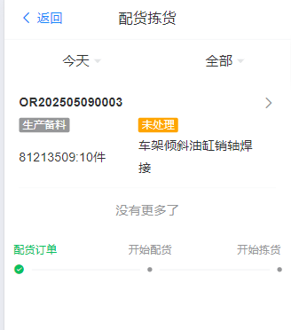  
点击详情，输入拣货库位，开始配货，如下图：  

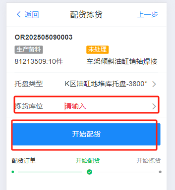 

进入到下一步，输入分拣库位位置，开始拣货，如下图:  

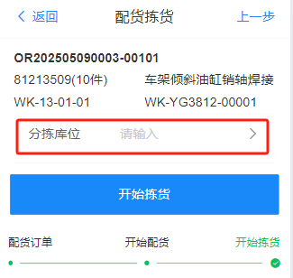 

**点击确认后，系统将产生2项任务分别为空托出库和拣货任务项，如下图：**

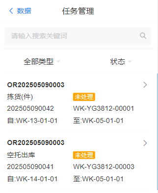，  

**K区业务源-功能-拣货-下一步，找到拣货任务，进入到详情页，点击确认，如下图:**

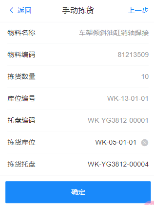

完成拣货任务以后，系统自动创建整托上架任务，如下图：   
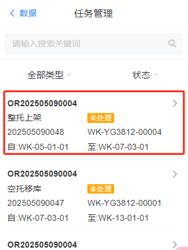

## 油缸发货 ##

K区业务管理员通过RF端-任务-完成分解任务，系统自动上架以后，触发配盘叫料任务，通知可以进行发货,如下图:

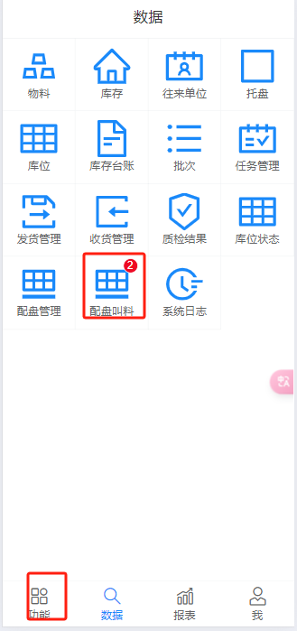  

进入到配盘叫料详情页-根据发货单号选择对应的发货单，点击详情，如下图：

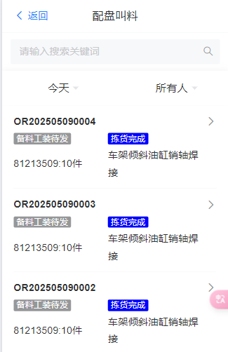 

点击发货项详情，进入详情页，填写发货区域-点击开始发货-完成发货，并自动创建发货任务，如下图：

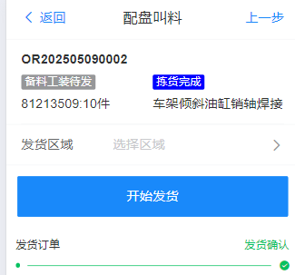 

完成后，RF端-数据-任务-发货任务,点击完成完成发货，如下图：

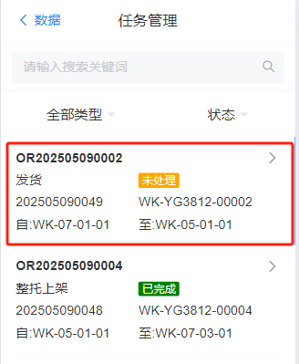 