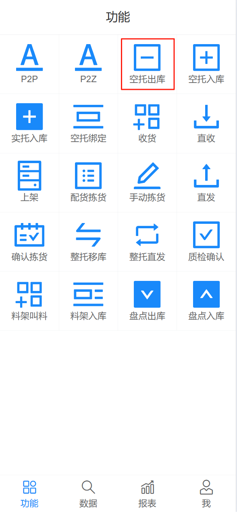
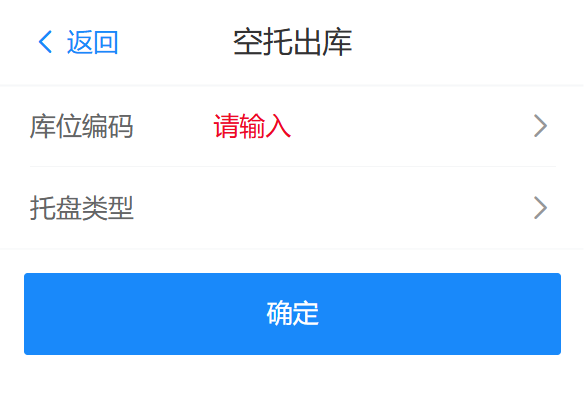
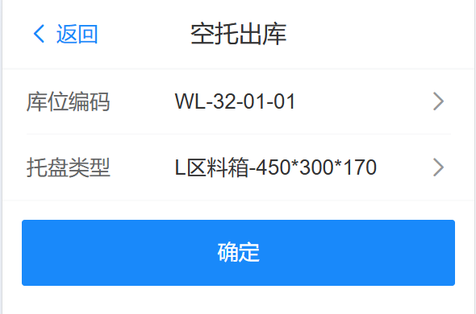
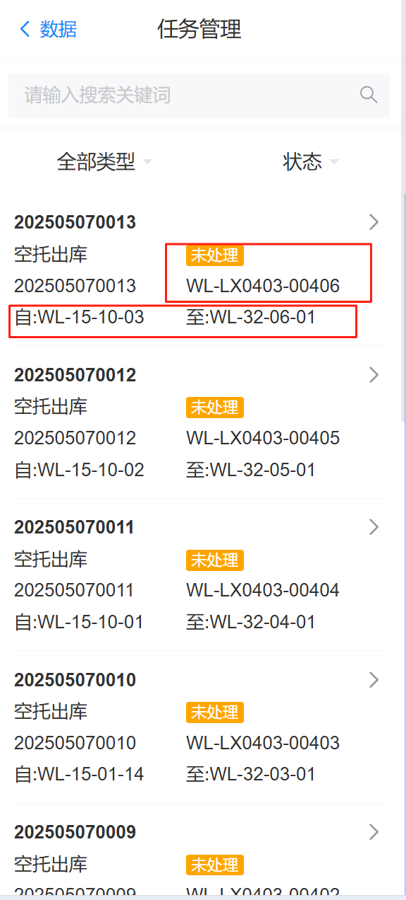

# 空托盘组出库

收货时，空料箱出库到标准件翻包区，进行收货上架，空托盘组为自动调用，人工操作只能一次出库一个托盘，下图展示手动操作

## 空托出库

{width=300px}

操作人员将信息补充完整，后，点击确认按钮生成出库任务，等待agv搬运自动完成

库位编码：翻包区库位编码

托盘类型：L区料箱

 

## 出库任务

生成从库区到翻包区货位的信息，等待agv搬运自动完成

{width=300px}