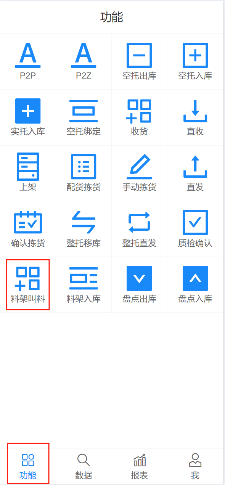
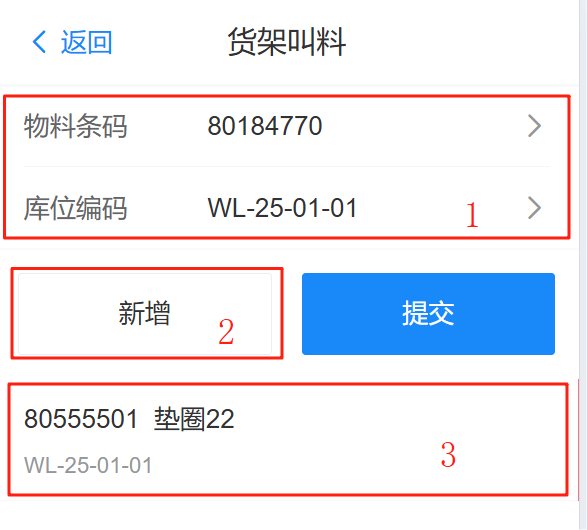
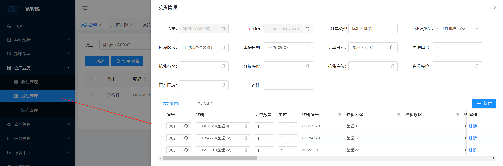
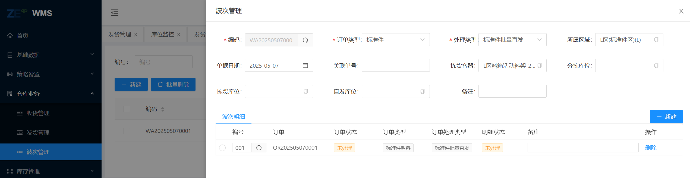
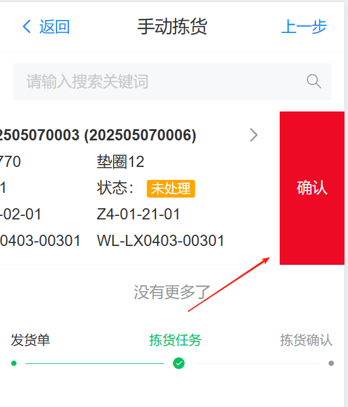

# 标准件波次叫料

包含 货架叫料、产线确认拣货，从密集库出库到料箱活动料架上，再通过AGV搬运至生产线体上，人工进行RF端拣货确认后，运行到下一目标点进行拣货确认。

## 货架叫料

包含 新增、提交 功能

操作人员通过RF端，进行物料呼叫，扫描（选择）物料，产线货位编码，“新增”按钮记录当前扫描的物料，可以进行多个物料的添加。“提交”按钮则会创建出库单

{width=300px}

{width=300px}

## 波次

在WMS的web管理系统中“发货管理”，可以查看到通过RF设备新增的数据信息，然后配置波次信息（支持手动和自动配置波次信息）

手动配置波次信息，包含配货、打印发货单、保存、撤销配货、下发拣货任务、打印发货单、拣货确认

订单类型：选择 标准件

处理类型：选择 标准件批量直发

所属区域：选择 L区

拣货容器：选择 L区料箱活动料架

确认无误后，点击配货按钮，配货完成（订单状态根据库存配货，完成后订单更改为“配货完成”），再点击“下发拣货任务”，便可以再系统中查看到拣货的任务信息

## 手动拣货

当货物达到产线后，由操作员在R系统“手动拣货”中，进行人工确认拣货，直到最后一个货物拣货完成

{width=300px}
