# 收货上架

收货分为两种方式，默认从mom中拉去收货单

收货：有收货单的收货

直收：没有收货单的收货

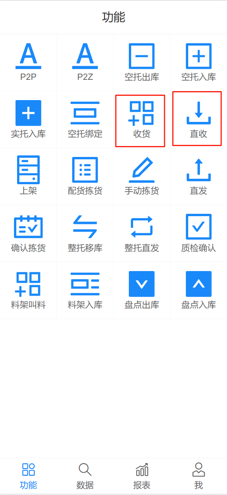{width=300px}

## 直收

1. 选择物料，扫描翻包区货位编码，托盘编码，点击下一步

2. 输入数量，确认无误后，点击确认按钮完成收货

  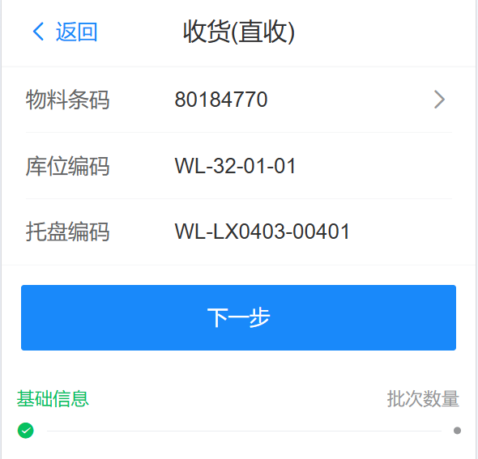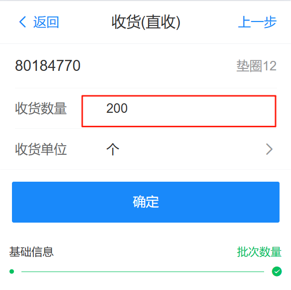 

## 收货

### 收货管理

可以手动创建收货单，默认从mom中自动拉取，选择收货的物料信息，并输入数量

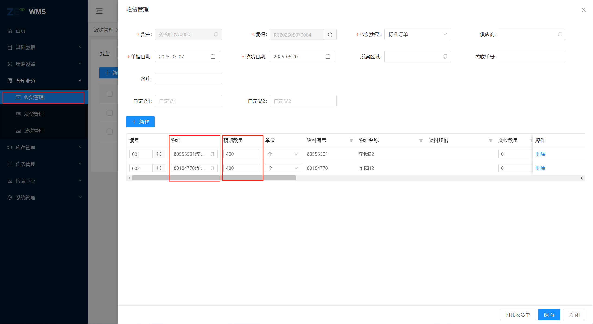

### RF端-收货

需要先选择收货单，然后点击下一步进行收货
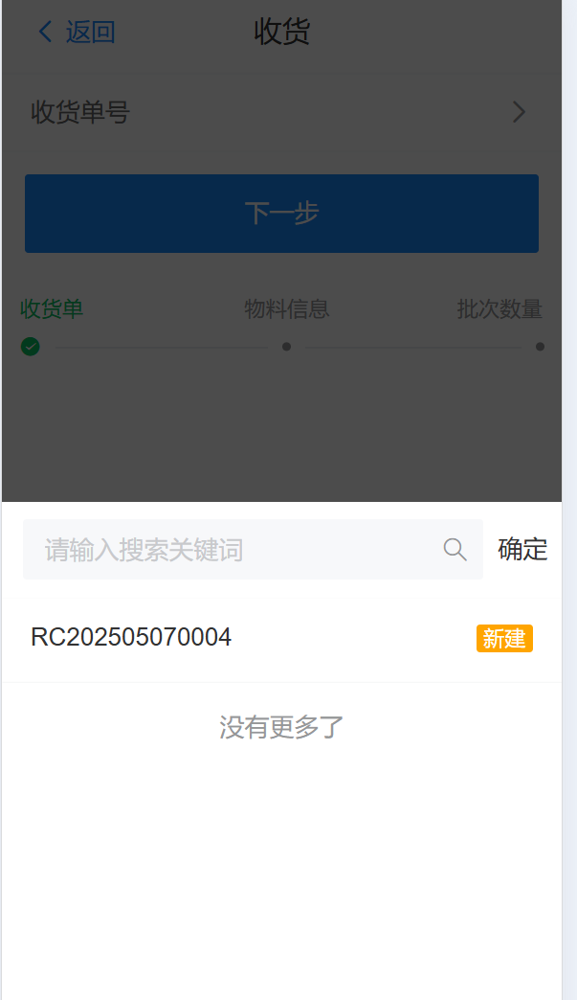{width=300px}
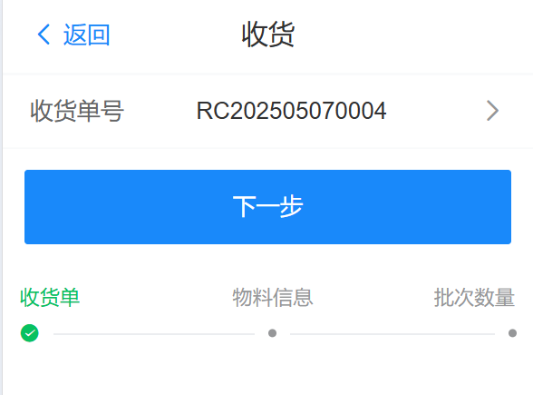{width=300px}

1. 选择物料，扫描翻包区货位编码，托盘编码，点击下一步

2. 输入数量，确认无误后，点击确认按钮完成收货

  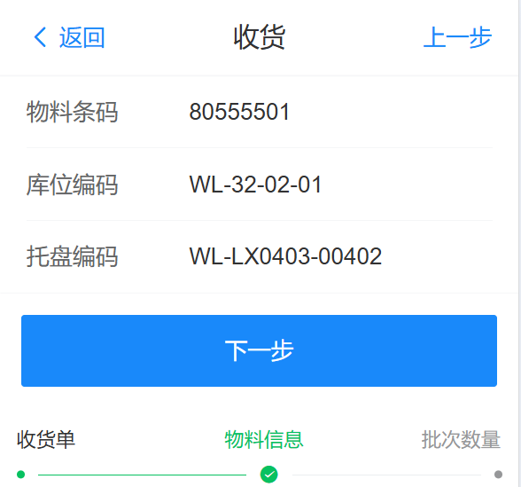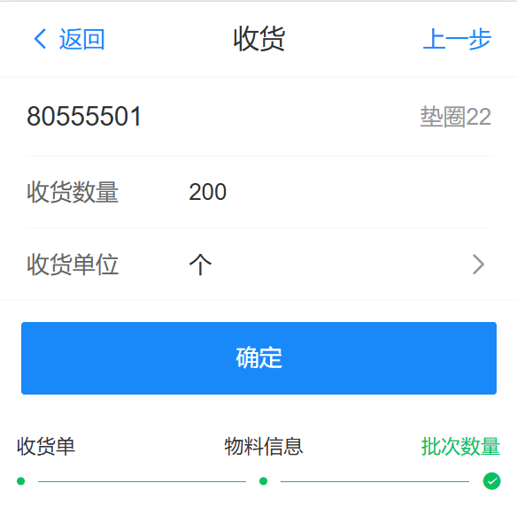 

## 上架

1. 通过web端收货管理中 生成上架任务 生成上架

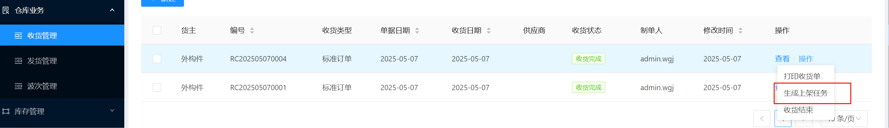

2. 通过RF端“上架”生成上架入库任务

  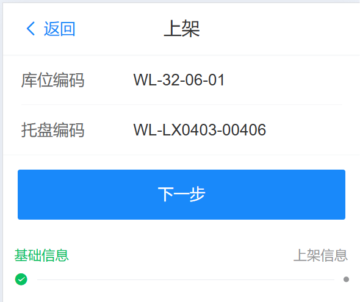
  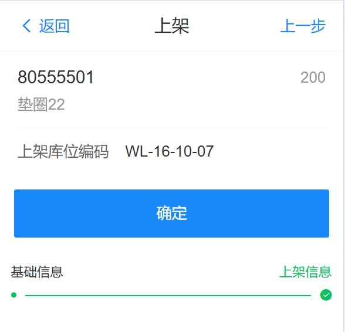 

