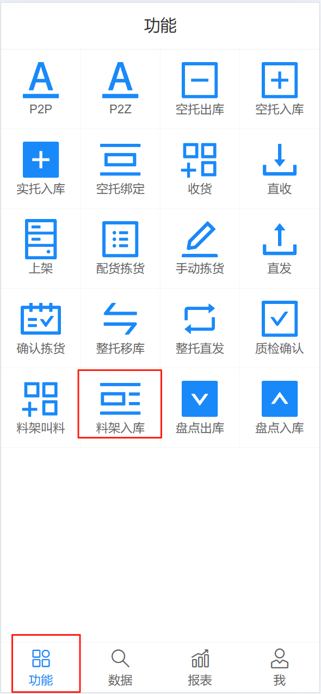
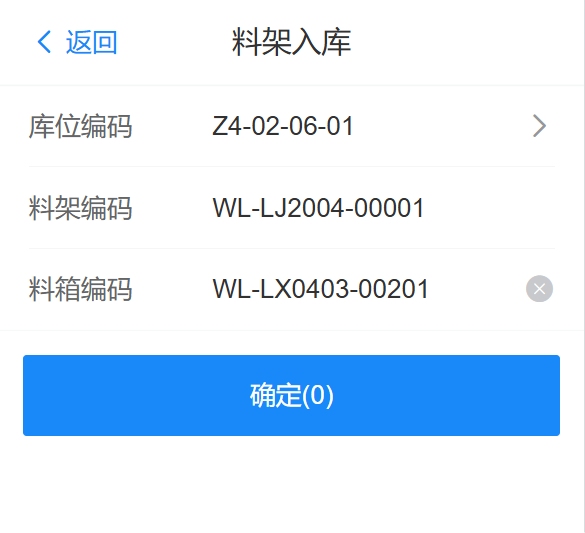
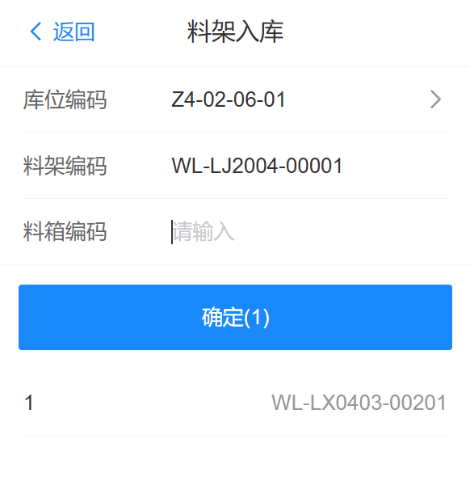
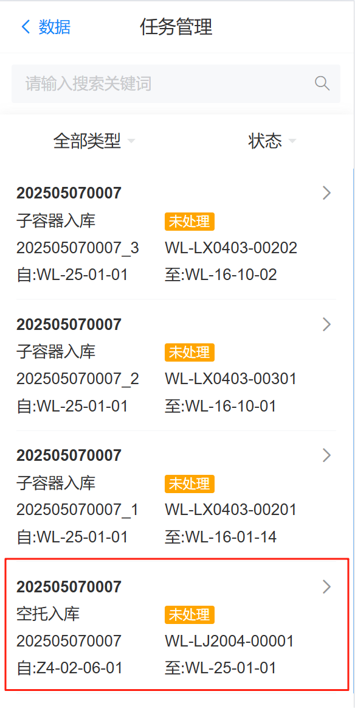

# 空料箱，料架自动退库

包含 料架入库、料箱入库；全程自动，同时也可支持手动空料箱、料架入库，下面介绍手动流程

## 料架入库

RF端“料架入库”，针对于标准件空料箱，料架入库

{width=300px}

操作人员将信息补充完整

库位编码：产线的库位编码

料架编码：活动料架号（托盘号）

料箱编码：空料箱号（托盘号）

注意：当一个料架有多个空料箱时，按照顺序，在扫描完料箱编码后，按下回车件，然后再扫描其他的料箱，当所有扫描完成后，点击“确认”按钮进行任务释放

 

## 料架入库任务

然后系统会产生“空托入库”和“子容器入库”任务，空托入库：活动料架入库。子容器入库：料架中的空料箱入库。只有当空托入库完成后，才可以完成子容器入库任务

{width=300px}