# 盘点

## 创建盘点订单

在盘点前，系统要知道需要盘点的库存范围

1. 按上架区域盘点
2. 按物料盘点
3. 按货主盘点
4. 按批次盘点

比如我们做月度盘点，要把所有物料库存全部盘一次。

我们也可以在一个订单里把所有物料一次性全包进来

也可以把盘点订单拆分，按区域，每个人负责一个区域

订单创建如下图所示

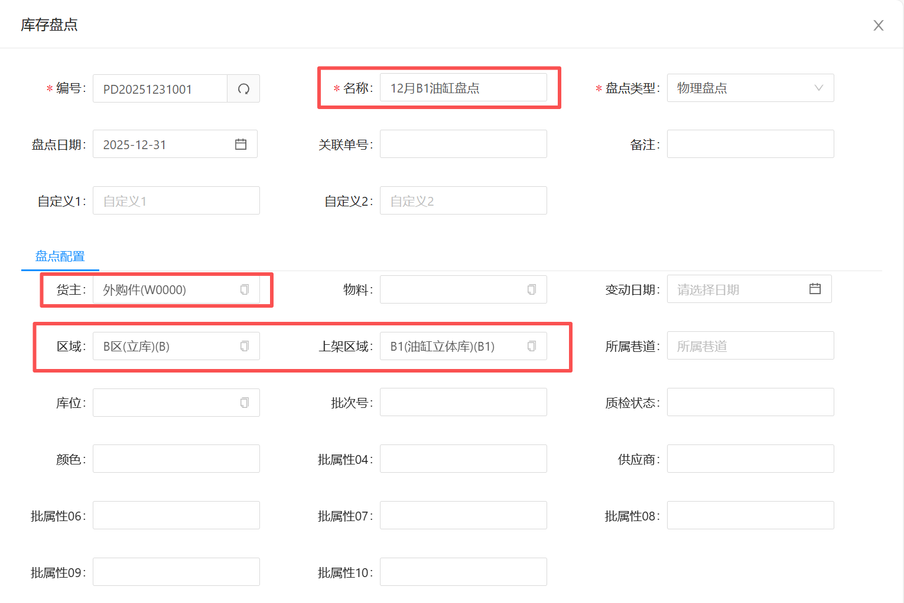

我们在盘点配置里，选择要盘点的范围

1. 如果想盘点某一个货主的所有物料，我们就只选择货主一个配置就可以
2. 如果只想盘点某一种物料，那我们就选择货主与物料的配置
3. 如果只想盘点某一个区域的所有物料， 我们就选择货主与区域
4. 如果想盘点某一个批次的物料，我们就选择货主/物料/批次

然后点“保存”按钮，系统就自动根据盘点配置的范围，创建盘点订单

## 开始盘点

当仓库人员确认盘点范围与需要盘点的数据没有问题

就可以点击盘点订单的“开始”按钮，开始进行盘点

在没有点开始按钮前，盘点范围是可以一直修改，直到正确

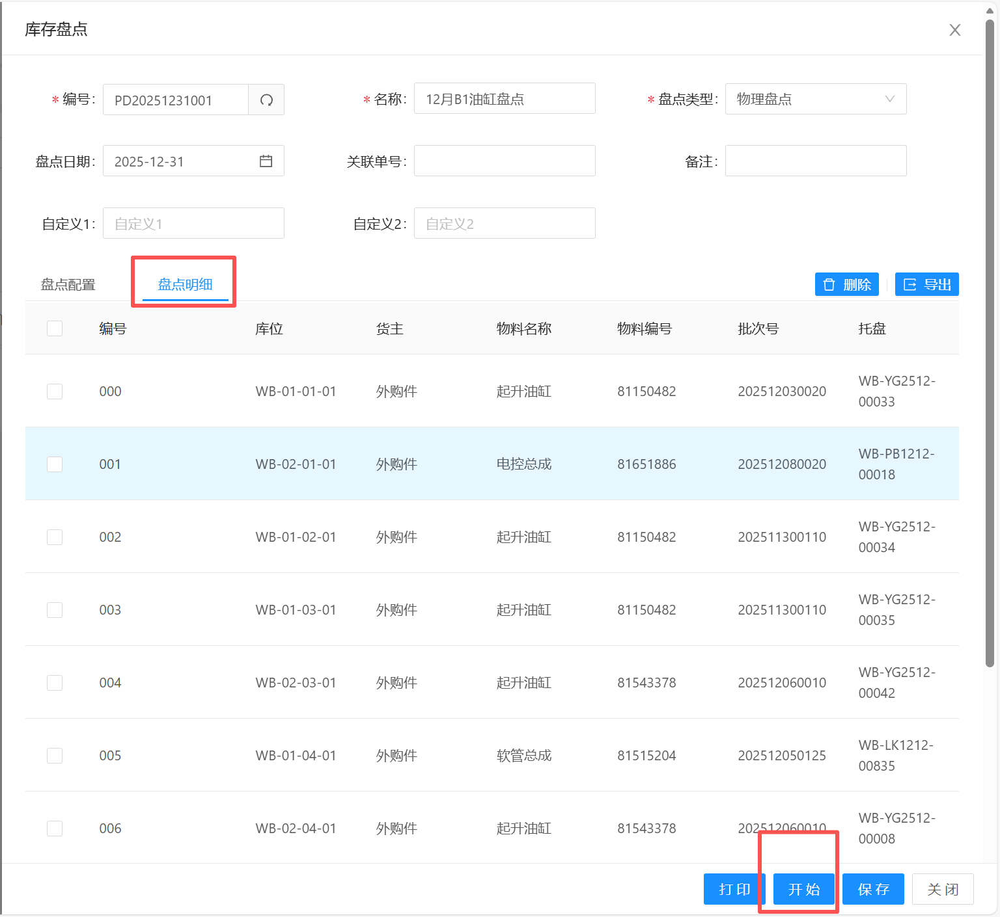

## PDA盘点（方式一）

在PDA的“功能”->"盘点"中，我们可以看到状态为“盘点中”的盘点订单

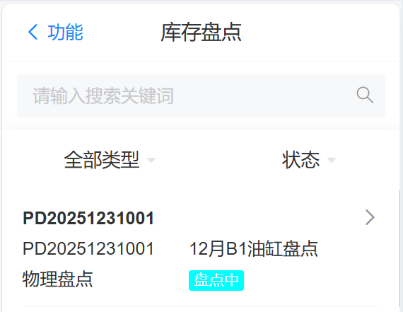{width=350}

点击或左滑进入盘点明细，可以看到需要盘点的库存

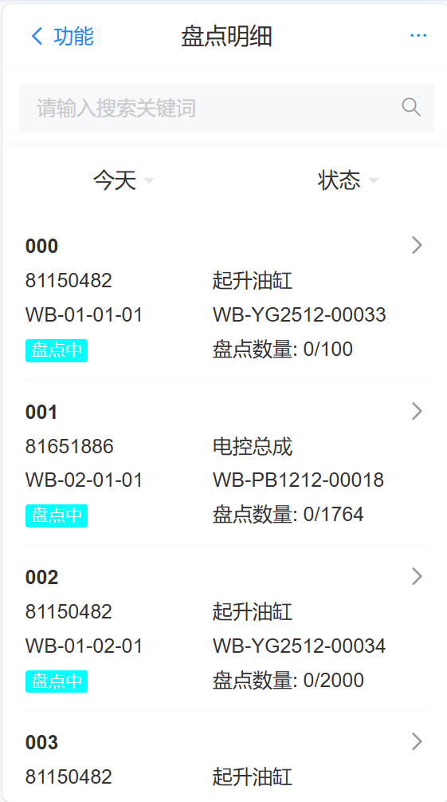{width=350}

仓库人员可以在搜索框中根据物料/托盘/库位搜索需要盘点的库存

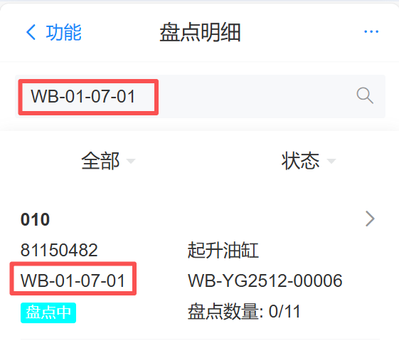{width=350}

找到对应需要盘点的数据，点击或左滑进入盘点确认界面

可以看到需要盘点的库存的信息

* 同时需要输入实际盘点的数量

然后点“确认”按钮确认此项库存盘点数据

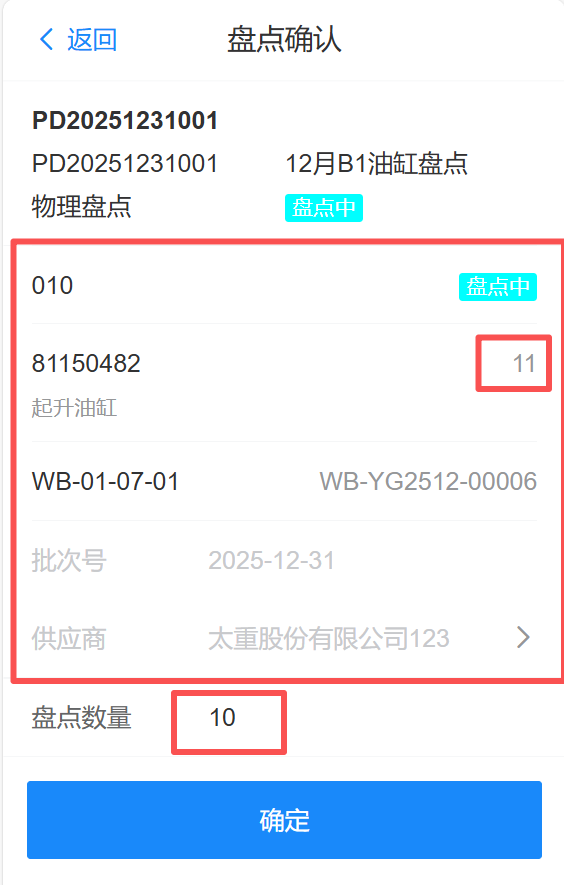{width=350}

确认后，可以看到当条数据状态已经变成“已盘点”

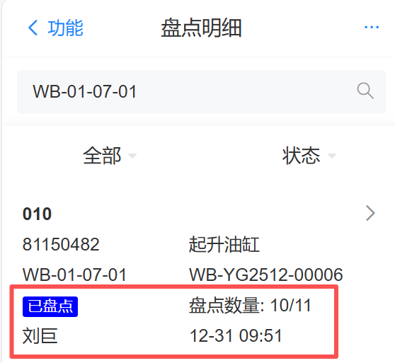{width=350}

## 纸单盘点（方式二）

当盘点开始后，点击盘点订单的“打印”按钮

系统会把要盘的库存打印出来

然后人工可以去实际位置去盘点

并在纸单上记录下实际盘点数量

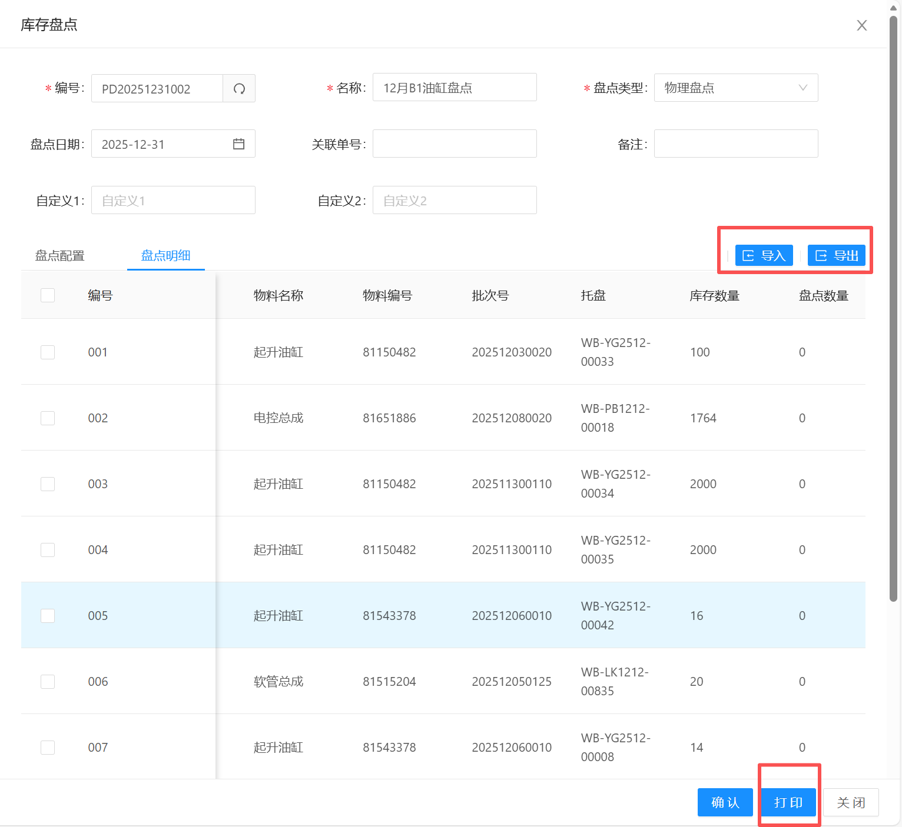

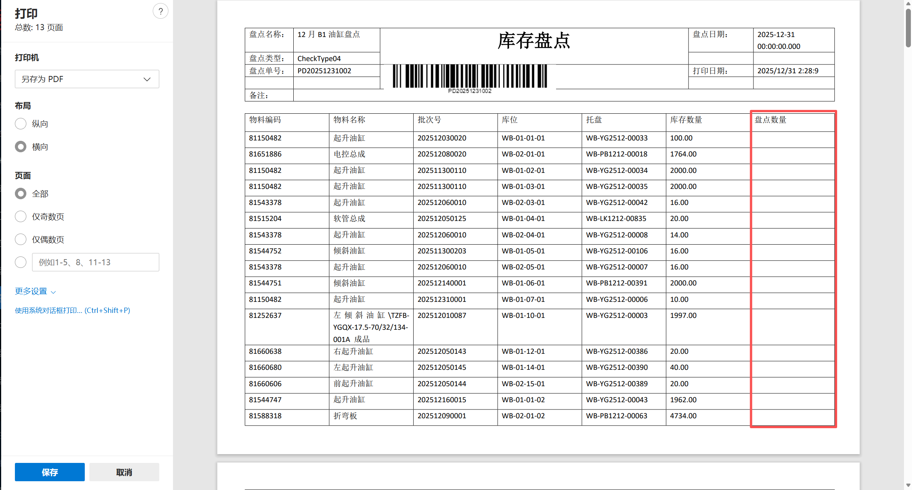

当人工把库存都盘点完成后，点击“盘点明细”->“导出”按钮

在导出的Excel里面录入对应盘点数量/盘点时间/盘点人信息

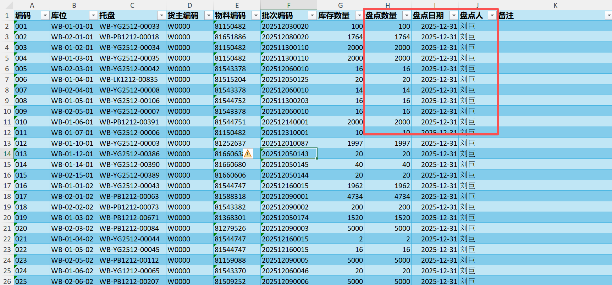

然后通过点击“盘点明细”->“导入”按钮，把对应的盘点数据全部导入进系统

## 盘点确认

当盘点订单里所有库存都已经盘点完成后

* 找到盘点订单，仔细核对盘点数据
* 确认无误后，点击盘点订单的“确认”按钮

操作完成后，盘点订单变成“已盘点”状态

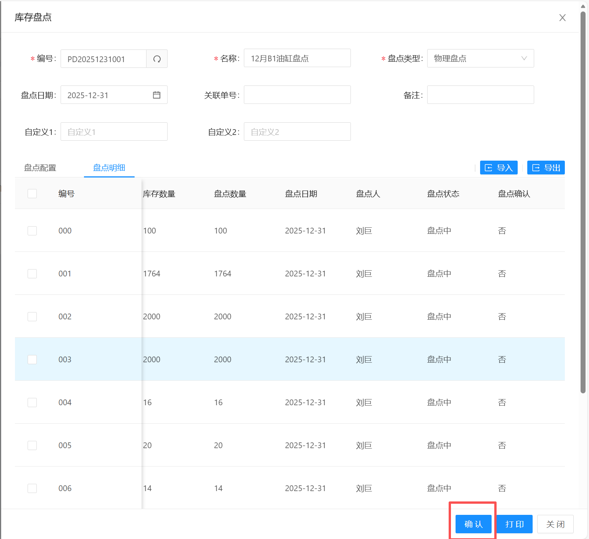

## 盘点复核

仓库管理员复核对应的盘点数据，仔细查看盘点差异。

* 确认盘点数据/盘亏/盘盈数据复核准确后，
* 点击盘点订单的复核按钮，表示盘点数据复核完成

操作完成后，盘点订单的状态变为“已复核”

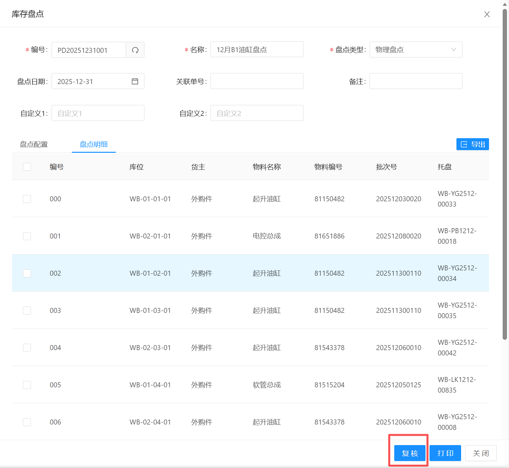

## 库存调整

如果盘点存在盘亏/盘盈数据

盘点复核后，盘点订单会有“调整”按钮出现

当点南调整按钮后，系统会在“库存管理”->"库存调整"功能中

自动生成库存调整订单

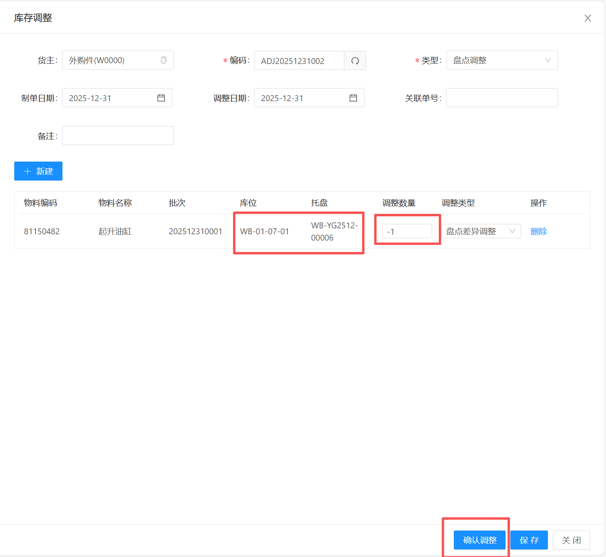

点击库存调整订单的“确认调整”后

库存会把库存调整为实际确认的库存数量

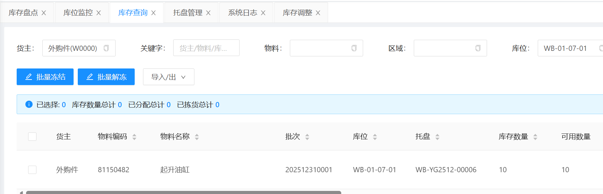

## 盘点完成

当盘点没有差异，或者库存已经调整完成后

仓库管理员需要点击盘点订单的“完成”按钮

表示当前盘点订单盘点完成

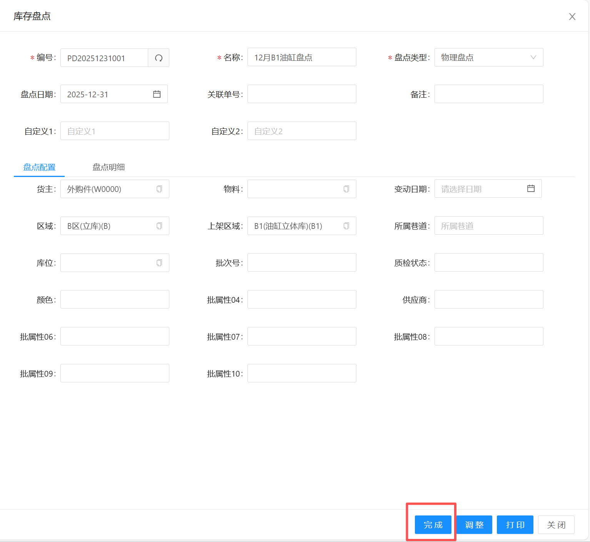

