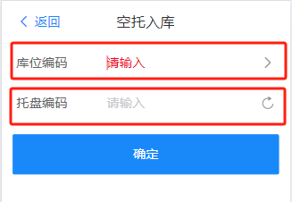
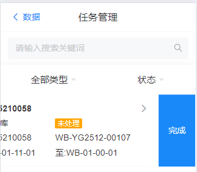
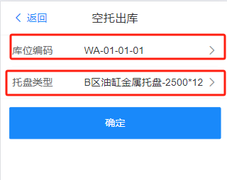
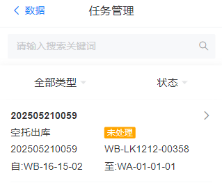
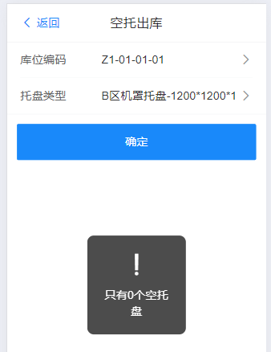
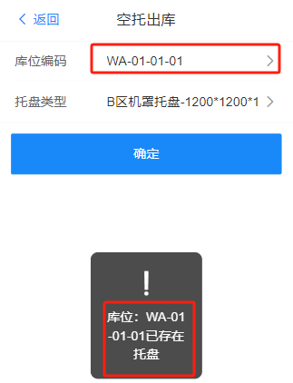

# 空托操作

RF端提供空托操作项分别为空托入库和空托出库

## 空托入库

前置条件：空托入库需满足[设置物料托盘类型的<b>上架策略</b>，点击此处](../../feture/bas/sku#sku-1)

进入RF端-功能-空托入库，输入库位编码和托盘编码，点击确认，完成空托入库，系统触发空托入库任务，操作如下:

 

点击确认后，等待线下立库输送位或者接驳位的AGV送达目标库位后，

进入RF端-数据-任务-找到空托入库任务类型，点击完成任务，如下图:

注：入库时，库位编码所在位置必须是空库位

 

## 空托出库

进入RF端-功能-空托出库，输入库位编码和托盘类型，点击确认，完成空托出库，系统触发空托出库任务，操作如下:

 

点击确认后，等待线下立库输送位或者接驳位的AGV送达空托后，

进入RF端-数据-任务-找到空托出库任务类型，点击完成任务，如下图:

 

注：出库时，目标出库位置所在库位必须是空库位，没有空托盘

## 空托出库和入库异常

1.出库时，托盘所在区域没有足够的空托

 

2.出库时目标库位已存在托盘

3.目标库位不支持该料框

