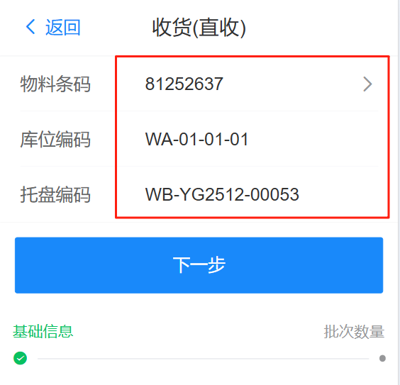
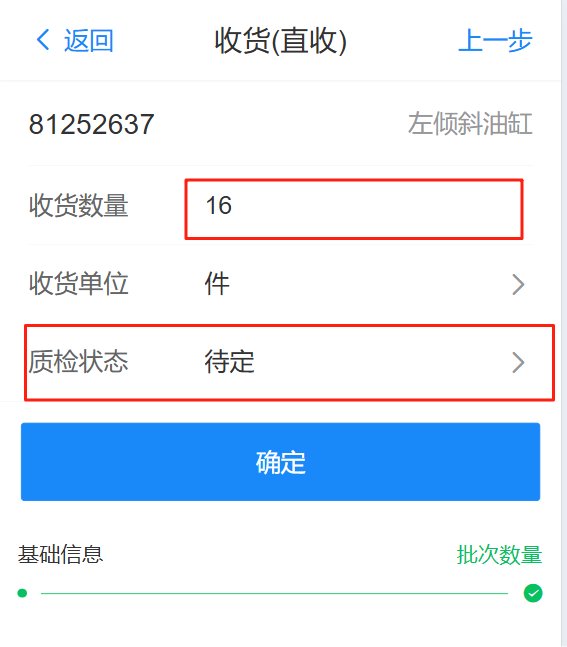
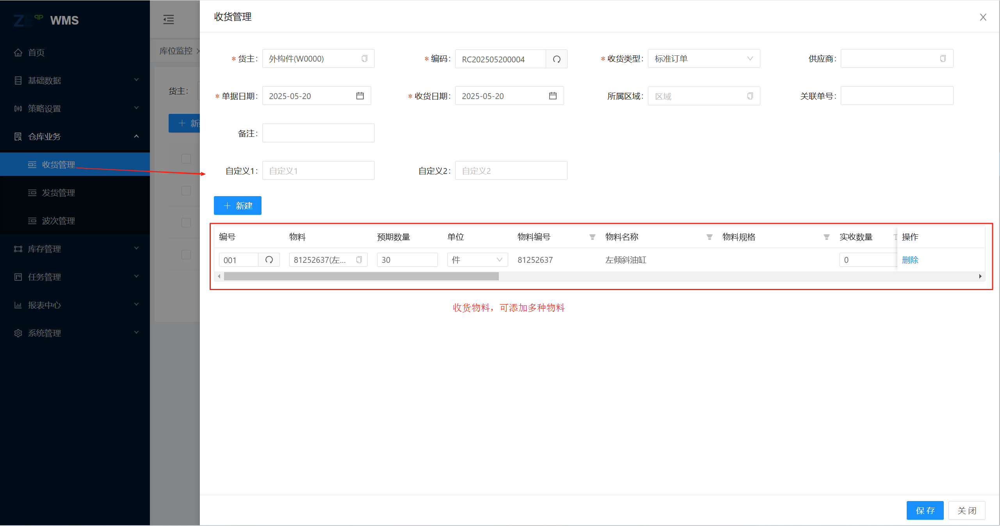
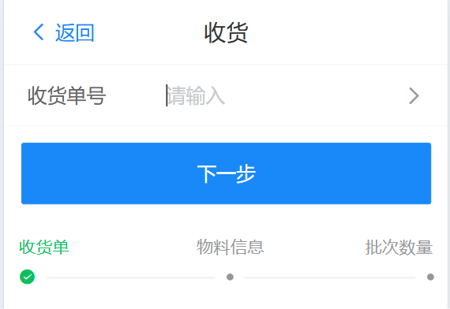
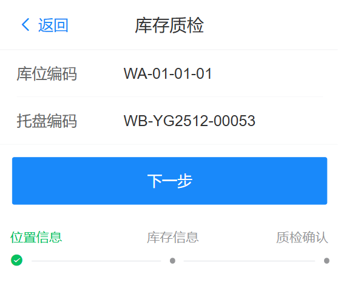
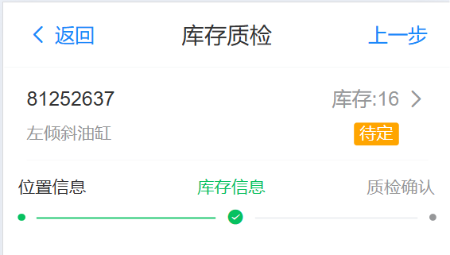
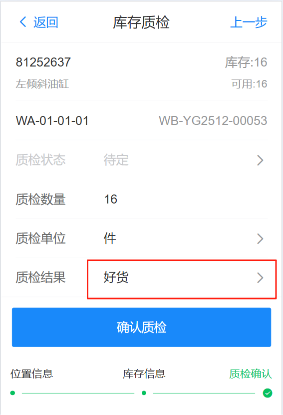
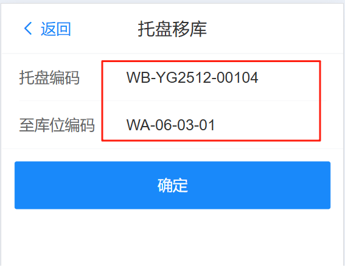
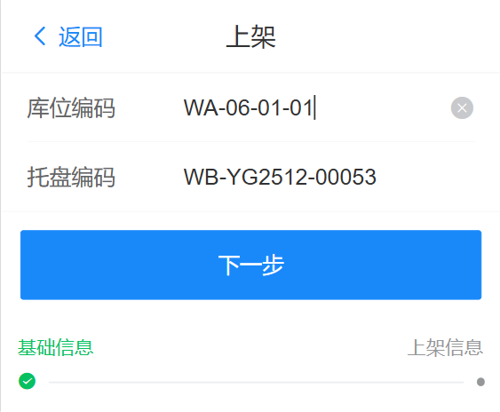
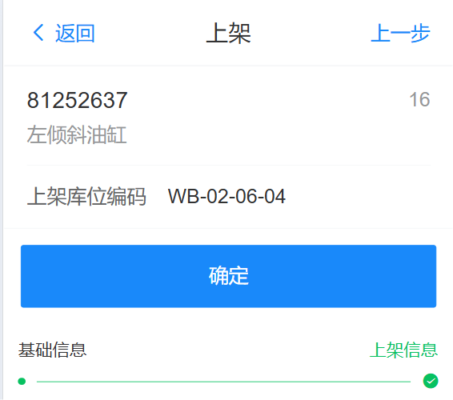

# 收货

## 直收

无需发货单，直接进行物料直收，进入RF端页面，点击 功能》直收，输入如下信息，点击下一步

{width=300px}

输入如下数量，质检状态（按批次策略所配置显示），点击确定完成收货

{width=300px}

## 按收货单收货

### 创建收货单

按照收货单进行物料收货：

&nbsp;&nbsp;&nbsp;&nbsp;1.wms系统拉取MOM系统订单，自动创建收货单

&nbsp;&nbsp;&nbsp;&nbsp;2.手动创建收货单

如下手动创建收货单：在wms系统的Web端，仓库业务》收货管理 中新增收货单数据，添加收货物料，预期数量，然后保存信息

### RF端收货

进入RF端页面，点击 功能 》收货，输入收货单号，点击下一步

{width=300px}

输入或扫描 物料条码、库位编码、托盘编码，点击下一步

{width=300px}

输入如下数量，质检状态（按批次策略所配置显示），点击确定完成收货，当收货数量大于等于收货单中的预期数量，收货单则自动完成

{width=300px}

## 质检

质检时，[需要设置物料的批次策略](../../feture/bas/sku#sku-2)

进入RF端页面，点击 功能 》质检确认，扫描输入库位编码，托盘编号，点击下一步

{width=300px}

系统加载当前位置 物料的质检状态信息，点击信息，进入下一步

{width=300px}

选择质检结果，可以更改质检数量，点击确认质检，完成质检

{width=300px}

## 移库

进入RF端页面，点击 功能 》托盘移库，扫描输入托盘编码，至库位编码，点击确认

{width=300px}

## 上架

上架时，[需要设置物料的上架策略](../../feture/bas/sku#sku-1)

进入RF端页面，点击 功能 》上架，扫描输入库位编码，托盘编码，点击下一步

{width=300px}

系统自动分配上架库位编码，点击确认生成上架任务，等待任务完成，完成入库

{width=300px}