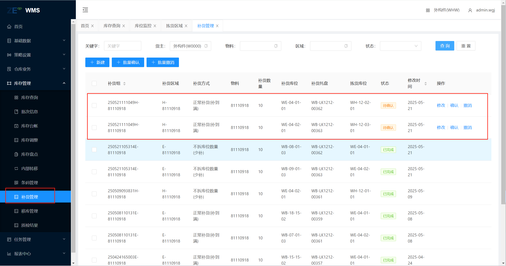
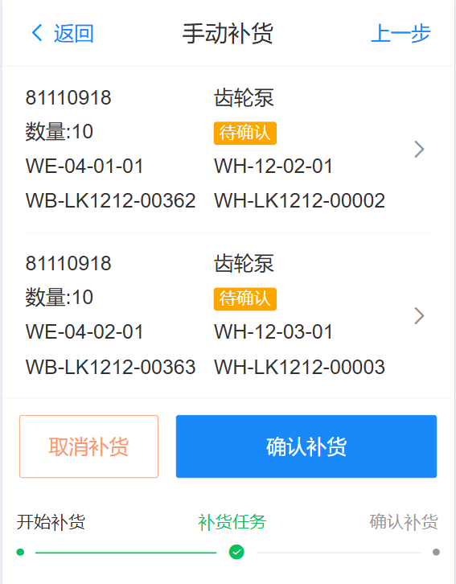

# 补货

对某个区域进行物料补货，系统中主要分为自动补货和手动补货

## 自动补货

进入Web端页面，基础数据》拣货区域中，进行[拣货区域配置](../../feture/bas/pickZone#pickZone-1)，不需要点击补货按钮，由系统定时运行

## SPS补货

SPS补货为手动补货，需要先进行[拣货区域配置](../../feture/bas/pickZone#pickZone-1)，拣货库位中处理方式为“倒箱”。

### 拣货区域补货

进入Web端页面，点击“补货按钮”既可对当前配置的信息进行补货，在 库存管理》补货管理中，将sps补货信息，点击补货，进行补货管理生成，生成如下

### 手动补货

进入RF端页面，点击 功能 》手动补货 ，补货区域为E2，点击“补货”按钮，可以看到补货的具体信息，点击确认补货生成补货任务

{width=300px}

由avg搬运物料到目标位置，人工进行倒箱操作，完成补货任务；然后进行来料空托盘入库