# 发货

前置处理：完成[配盘策略配置,点击此处跳转](../../feture/stg/plate/)
## 下发货单
设置好配盘策略以后，通过RF端-数据-配盘管理，进行下单,如下图:
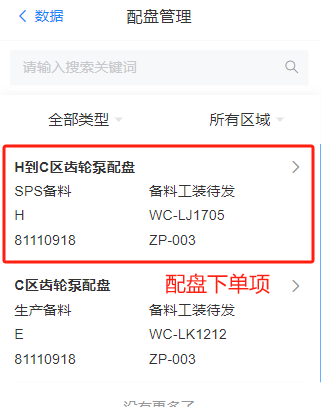  

点击进入详情，检查配盘订单内容，点击确认，触发配货拣货任务，如下图:
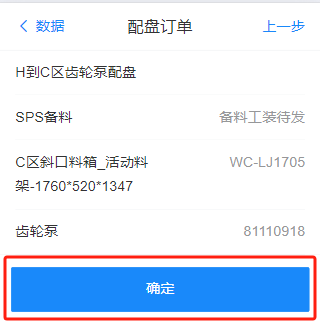  

## 配货拣货

通过RF端-功能-配货拣货，进入到配货拣货功能，找到发起的配货拣货订单项，如下图，
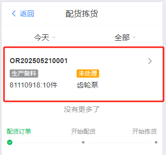    

点击详情，输入需要拣货的库位，点击开始配货,如下图

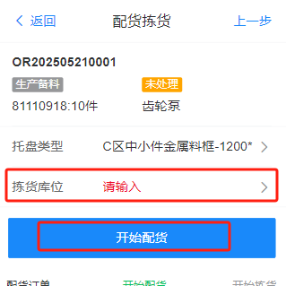   

输入分拣库位,如下图

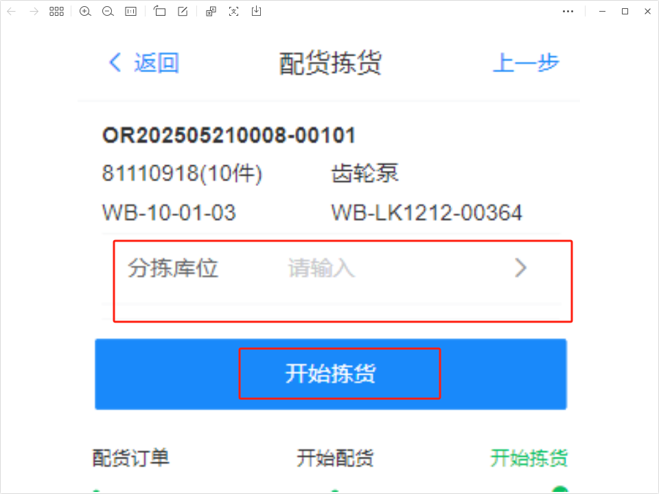    

点击开始拣货，触发分拣任务和空托出库，通过RF端-功能-任务看到任务列表，如下图

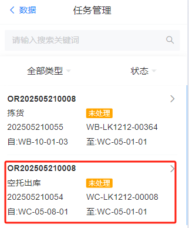  

注：空托出库,等待AGV将空托盘移动到对应库位上面。  

拣货员分两步走：
1.拣货员收到AGV的空托以后，通过RF端-数据-任务-空出出库类型，右滑动点击完成空托出库任务，如下图。
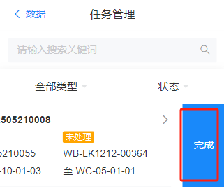  

2.拣货员线下拣货完成后，拣货员通过RF点击-功能-拣货-下一步进入到拣货任务-右滑动点击完成，完成此项拣货任务。
    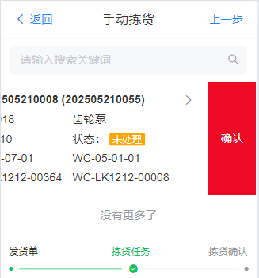  

3.点击完成拣货任务以后，系统触发空托移库(空托归还)和上架任务（完成拣货上架到待发区），如下图：
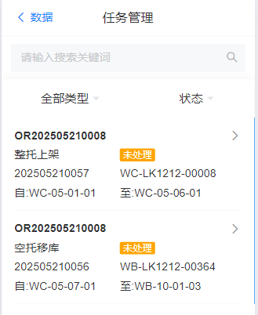 

注：通过RF端-数据-任务-完成两项任务，完成以后，触发配盘叫料。

## 叫料发货

通过RF端-数据-配盘叫料进入到叫料发货功能，如下图:

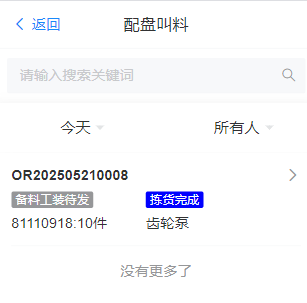 

点击配盘叫料的具体项-选择发货区域-点击开始发货，完成发货，如下图:

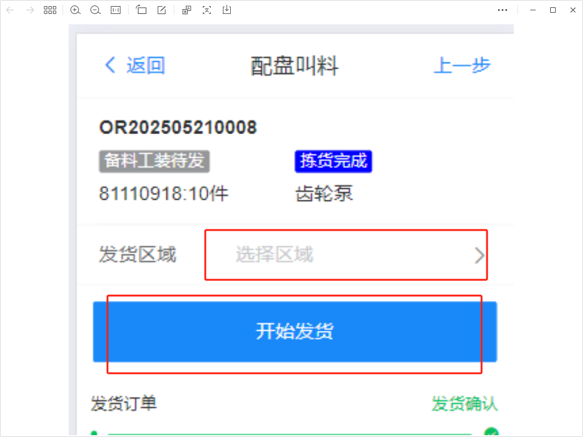 