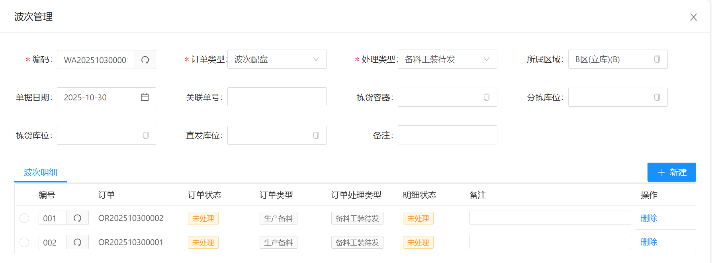
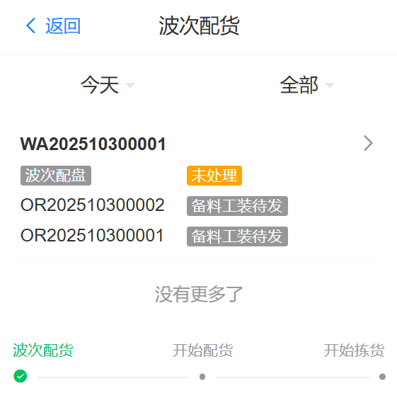
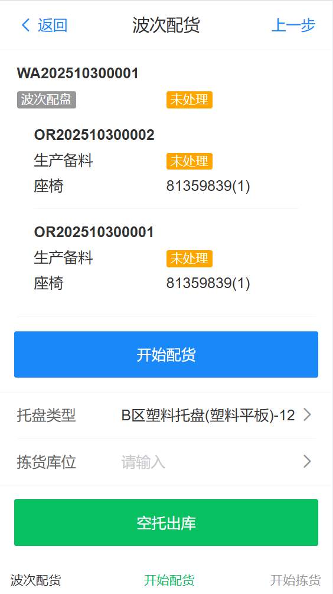
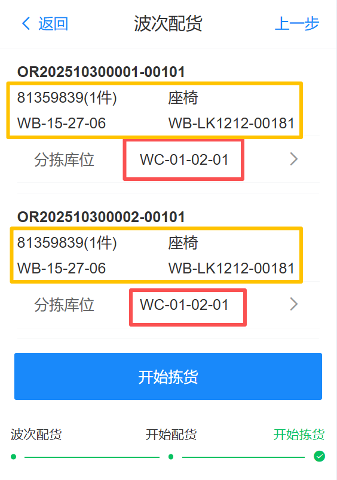
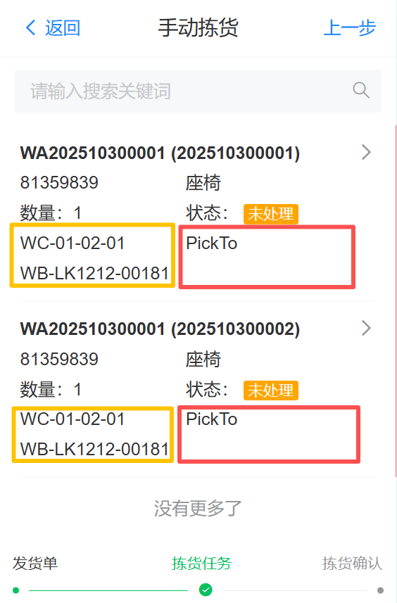
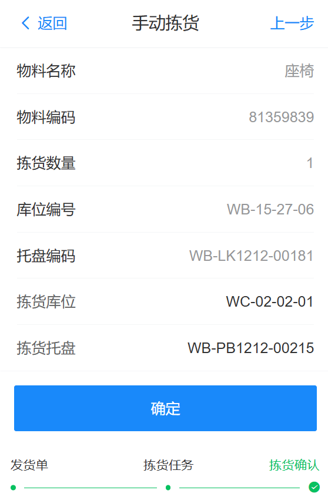
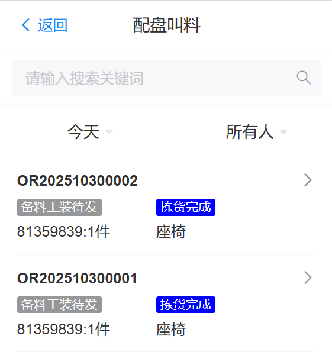
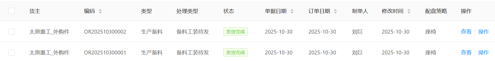
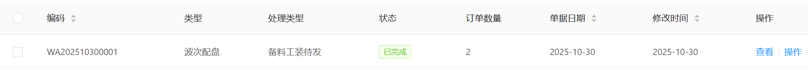
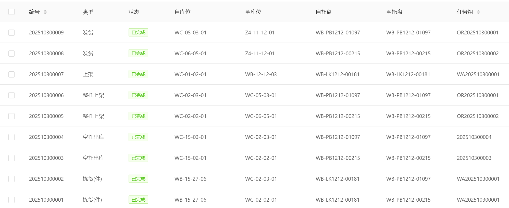

# 波次配盘

## 功能说明

当同一种配盘策略有多个订单时，操作人员可以同时批量拣货

此时同一波次的订单优先配货同一托盘物料，拣货任务都完成时，来料托盘才返回库区

比单个配盘订单节约时间，提高拣货效率

## 新建波次
   
在PC端导航菜单 “仓库业务”->"波次管理"

点击“新建”按钮，打开波次新建页面

**订单类型选择“波次配盘”，处理类型选择“备料工装待发”。并选择所属区域**

波次明细点击“新建”，选择配盘策略为同类型的发货订单

**必需为同种配盘策略才能组同一个波次**

订单的选择数量根据现场实际库位数量决定

(波次订单数量+配盘物料种类)<=空库位数量 或者 配盘物料种类<=空库位数量-1

选择完订单后，点击“保存”按钮，保存波次配盘订单

## 波次配货

在PDA端导航“功能”->"波次配货",可以看新建的波次订单
   

点击波次订单进入2级页面，可以看到当前波次订单的配盘单组成明细

以及当前波次订单下所有配盘订单的物料组成明细

可以操作的功能有2个

1. 波次配货（把当前波次的所有订单进行统一配货）
2. 空托呼叫（因为当前订单有多个配盘，所以要呼叫多个空托盘去拣货区域）

一般操作是波次下面有几个配盘订单，我们就先呼叫几个空托盘去拣货区域

然后点“开始配货”把当前波次订单统一配货

点击开始配货后，界面会跳转到当前波次配货完成的界面

这个界面就可以看到当前波次下所有订单以及配货的库位

因为是同一个波次，所以配货的时候把两个订单的物料配货在了同一个物料托盘

这样仓库只要出来一托盘物料就可以把当前两个配盘订单都拣货完成

**输入分拣库位**，对于仓库出来的同一个托盘物料，分拣库位必需是同一个位置

输入完分拣库位后点击“开始拣货”，系统会下发拣货任务给设备执行。

## 拣货

在PDA上导航“功能”->“拣货”

可以看到波次下发的所有拣货任务，

**这里的拣货库位为PickTo,拣货托盘没有**

因为系统不知道现场需要拣货至哪个库位和托盘，所以没有默认值

拣货人员需要点击进入当前拣货任务

**拣货库位和拣货托盘需要扫码输入原空托盘呼叫出来的空托盘和所在库位**

然后点确定，完成拣货

## 后续步骤

1. 配货完成上架至待发区与原订单配货流程一至
2. 配盘叫料与原订单配盘叫料一至

**配盘叫料**

**配盘订单完成情况**

**波次订单完成情况**

**当前波次订单所有任务情况**

