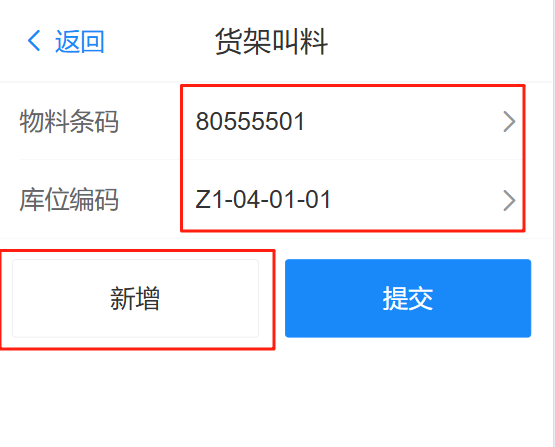
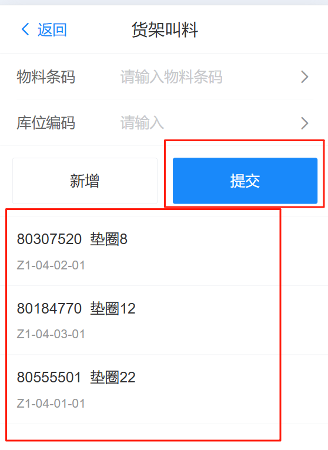
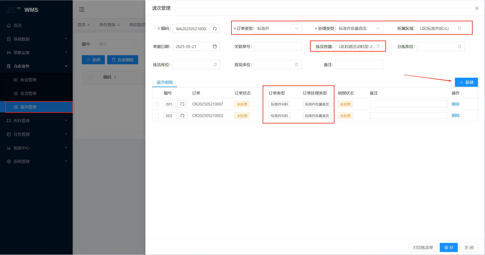
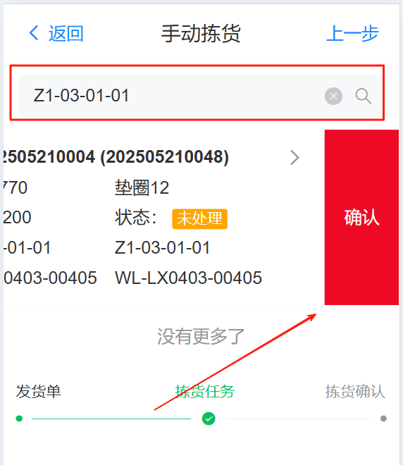
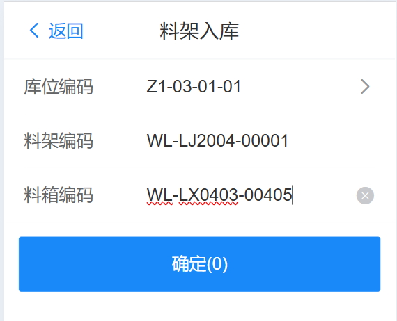
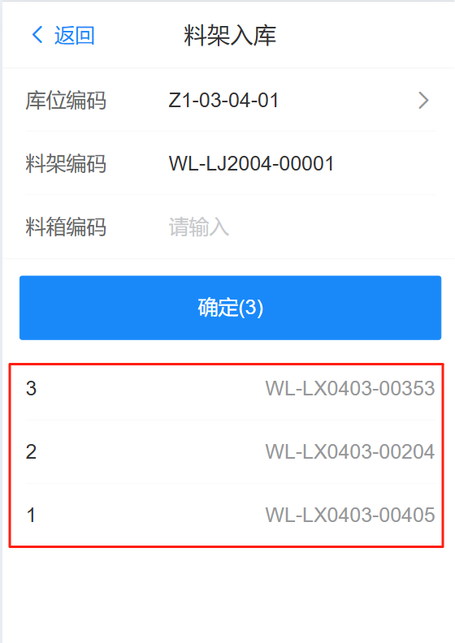

# 波次

## 料架叫料

进入RF端页面，点击 功能 》料架叫料，输入物料条码，产线库位编码，点击“新增”按钮，可以一次性呼叫多个物料，

{width=300px}

当需要的物料呼叫完成后，如下图所示，点击提交按钮生成发货单

{width=300px}

## 组波次

仅限于标准件组波次信息：

&nbsp;&nbsp;&nbsp;&nbsp;1.wms自动创建波次，下发执行

&nbsp;&nbsp;&nbsp;&nbsp;2.手动创建波次，手动下发任务

以下展示手动创建波次信息

进入Web端页面，仓储业务》波次管理中，点击新增按钮，在新增页面新增如下信息

&nbsp;&nbsp;&nbsp;&nbsp;1.订单类型：标注件

&nbsp;&nbsp;&nbsp;&nbsp;2.处理类型：标注件批量直发

&nbsp;&nbsp;&nbsp;&nbsp;3.所属区域：L区

&nbsp;&nbsp;&nbsp;&nbsp;4.拣货容器：L区活动料架

&nbsp;&nbsp;&nbsp;&nbsp;5.波次明细：选择发货单信息（类型=标准件叫料，处理类型=标准件批量直发，状态=未处理）

点击“配货”按钮，波次单状态更改为“已处理”

点击“下发拣货任务”按钮，波次单状态更改为“已释放”，等待物流搬运

## 拣货

进入RF端页面，点击 功能 》拣货中，如下图所示，输入货位号，然后将信息栏向左滑动，点击完成，完成拣货

{width=300px}

## 料架回库

&nbsp;&nbsp;&nbsp;&nbsp;1.LIP自动创料架回库任务，AGV搬运

&nbsp;&nbsp;&nbsp;&nbsp;2.手动创建料架回库任务

以下展示手动创建料架回库任务

进入RF端页面，点击 功能 》料架入库，输入库位编码，料架编码，料箱编码，按下回车键，可一对同一个料框添加多条记录

{width=300px}

如下图所示，添加多条记录，点击确认按钮生成空托入库，子容器入库任务，等待agv搬运自动完成

{width=300px}