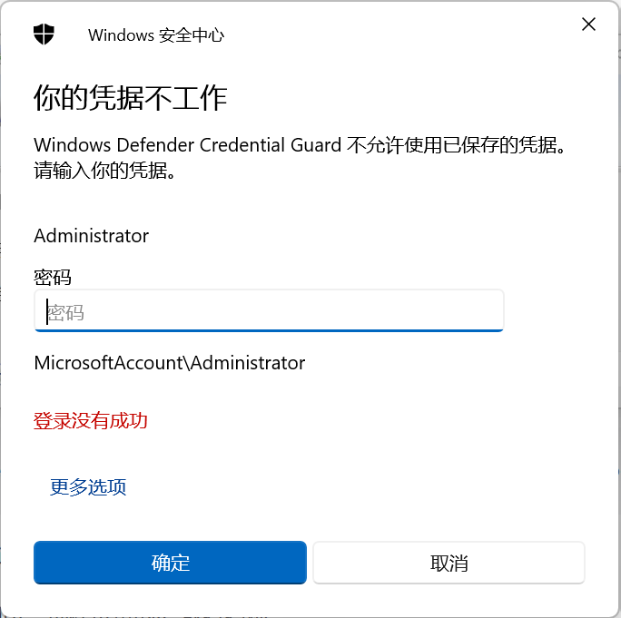
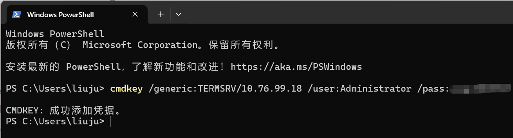
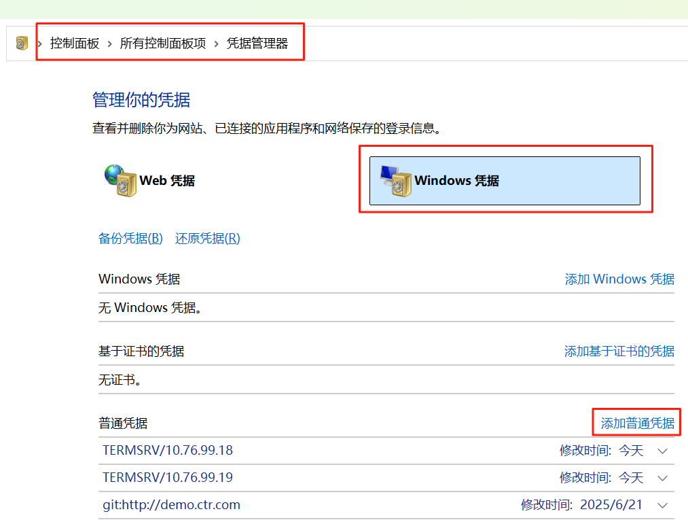
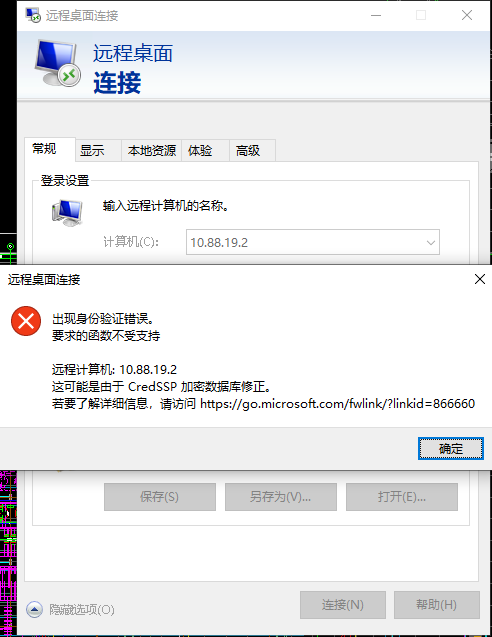
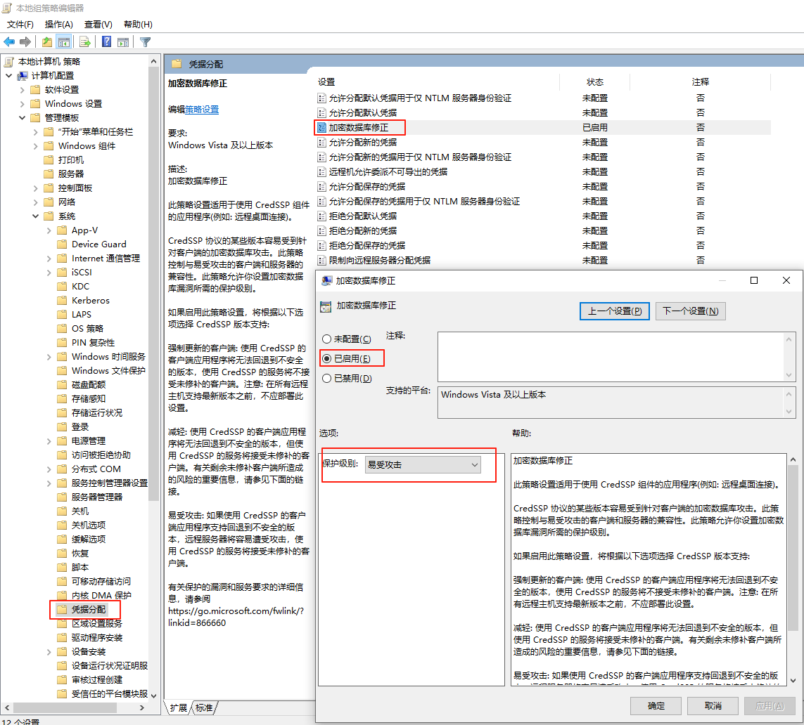

# 问题与答案

## Windows Defender Credential Guard不允许使用已保存的凭据。请输入你的凭证



方法一：

利用以下命令：

```cmd
cmdkey /generic:TERMSRV/{targetNameOrIp} /user:{username} /pass:{password}
```

添加密码到远程连接。

{targetNameOrIp}：远程设备的IP 或者名称

{username}：你的登陆名

{password}：登陆密码



方法二：

在控制面板\所有控制面板项\凭据管理器下面

选择Windows凭据，然后点击“添加普通凭据”



在添加普通凭据界面输入以下信息

Internet地址或网络地址：远程设备的IP 或者名称

用户名：你的登陆名

密码：登陆密码


## 如果使用Windows远程桌面出现身份验证错误



解决方案为

通过组策略编辑器修改（适用于Windows专业版/企业版）

打开组策略编辑器

按下 Win + R，输入 gpedit.msc，回车。

定位到凭据分配策略

依次展开路径：计算机配置 > 管理模板 > 系统 > 凭据分配。

修改加密数据库修正策略

双击右侧的 加密数据库修正，选择 已启用。

将 保护级别 设置为 易受攻击，点击确定保存。

重启远程连接

设置完成后，重新尝试远程桌面连接即可。

原理：此操作允许客户端回退到不安全的CredSSP协议版本，从而兼容未安装安全更新的远程服务器，但会降低安全性16。
